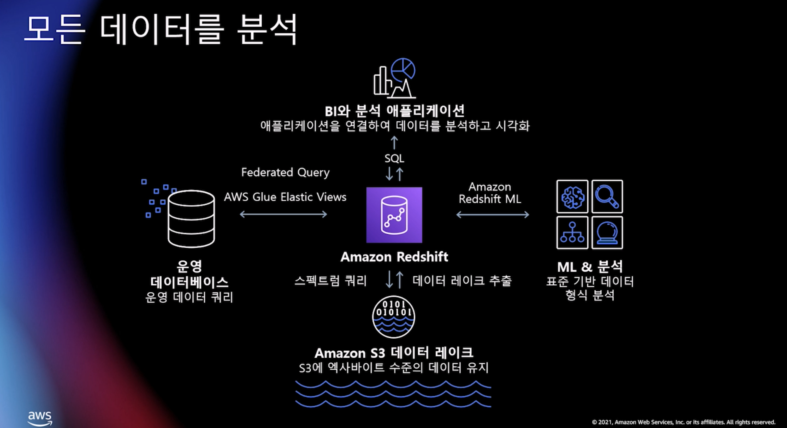
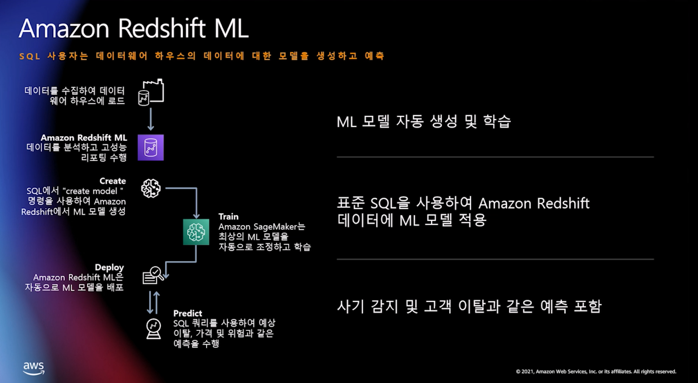
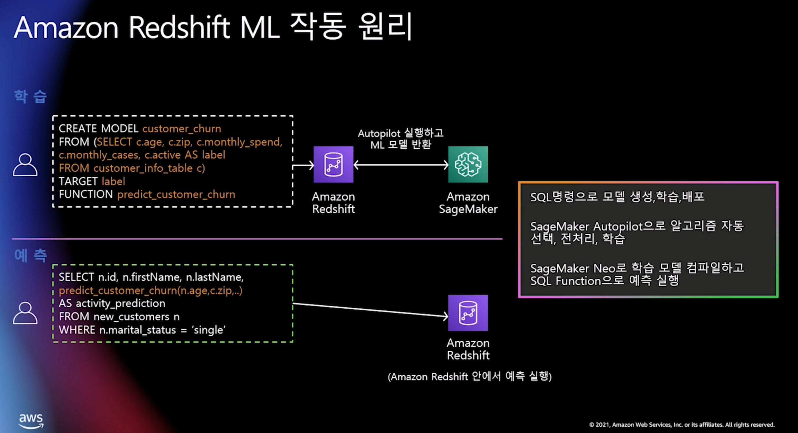
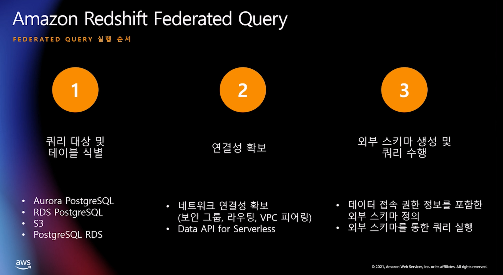

# Amazon Redshift와 Athena에서 기계학습(ML)과 Federated Query

- 링크: https://kr-resources.awscloud.com/data-kr/leveraging-machine-learning-ml-and-federated-query-with-amazon-redshift-and-athena-kr-level-300

## Amazon Redshift ML

- Redshift
  - 완전 관리형 데이터 웨어하우스
  - 컬럼형식, 분산 처리
  - 다양한 서비스 결합
  - DMS
  - Glue
  - EMR
  - Sagemaker
  - Quicksight
  - 
- Redshift ML
  - 6분정도 부터 시작
  - 따로 모델에 관련된 코드 작업이 필요없음
    - 
  - 작동 원리 (예시)
    - 
    - 학습 비용만 발생
      - max_cells와 max_runtime으로 학습할 데이터양 조절 가능

---

## Amazon Athena ML

- 특징
  - 표준 SQL을 사용하여 S3의 데이터를 쿼리할 수 있는 서비스
  - serverless
  - 스캔한 데이터에 대한 가격 지불
  - 데이터 파티셔닝 지원, DDL 지원
  - presto(in memory) query 엔진 사용
- Athena ML
  - sagemaker 엔드포인트를 호출하여 응답받는 형식
  - UDF 및 머신러닝 함수를 호출하는 구문

---

## Federated Query

- 연도별로 데이터가 저장소가 각각 다를경우 활용
- Redshift

  - 쿼리 실행 순서
  - 

- Athena

  - 내부적 동작
    - 람다 기반으로 federated query를 연결해줌

- 데모
  - redshift
    - RDS내 쿼리 에디터를 통해 DB로 연결
      - 현재는 Aurroa serverless 만 지원
    - 접속정보는 secrets manager에 저장
    - 외부 테이블을 생성하여 내부의 redshift 테이블과 조인 가능
  - athena
    - serverless application repository로 들어감
      - lambda jdbc connector를 선택함
    - connectior를

결론: s3와 redshift로의 통합만 이루어지면 좋을 듯
