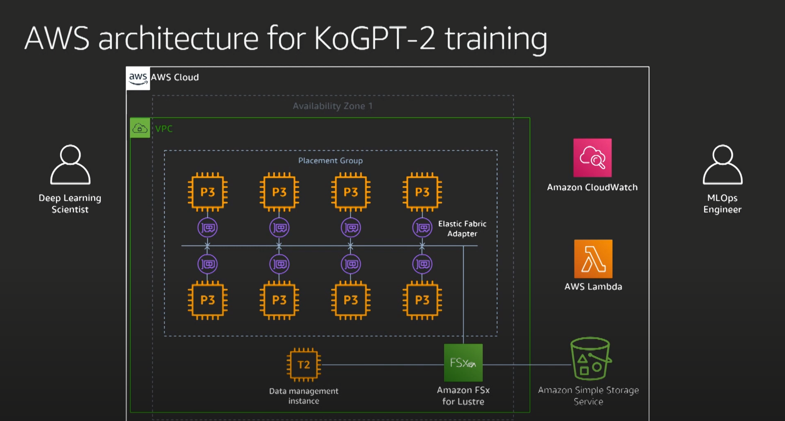

# 대용량 한글 자연어처리 모델의 클라우드 분산 학습 및 배포 사례

GPT2와 BERT가 대부분

mxnet을 통한 학습 학습량이 제일 많기 함

gpt에서는 분산학습을 더 빨리 했음

언어 모델 시연

---

mxnet과 horovod사용하여 분산학습

분산학습을 어떻게 진행했는가?

1. ec2 인스턴스 활용

- nvidia v100 gpu 인스턴스 사용
- elastic fabric adapter로 네트워크 구성
- fsx lustre shared storage

2. sagemaker

- 위에서 저장소만 s3로 변경

모니터링이 중요

- GPU 사용량 감소 + cpu 사용량 증가 + disk write 운영 증가 => 체크포인트 저장이 너무잦아 코드 변경

튜닝

- gelu
- bert adm

1 node에서 81퍼 의 상향

8개의 최고급 ec2 v100 5일동안 훈련이 최상의 속도

sagemaker도 똑같이 가능

---

inference작업 sagemaker

**Sagemaker deploy를 우리 모델로 predict 할 수 있는지 확인**
aws sample에서 확인가능
