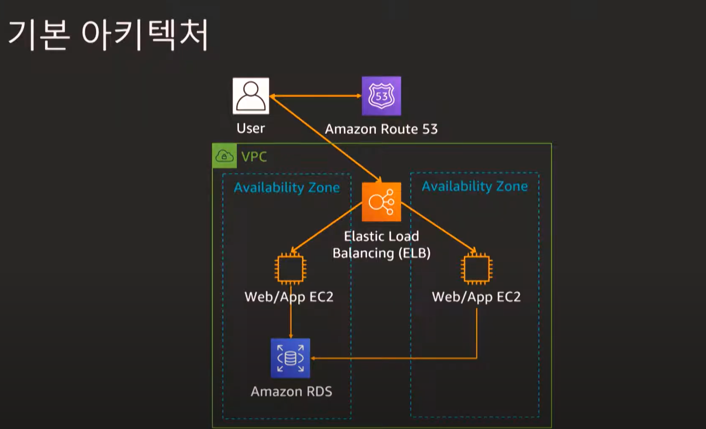
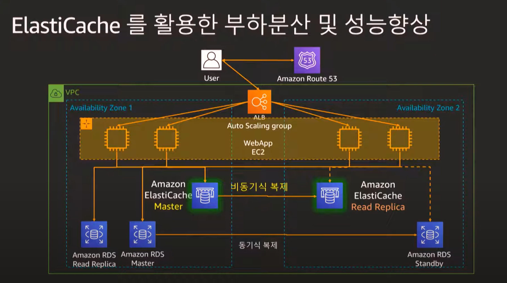
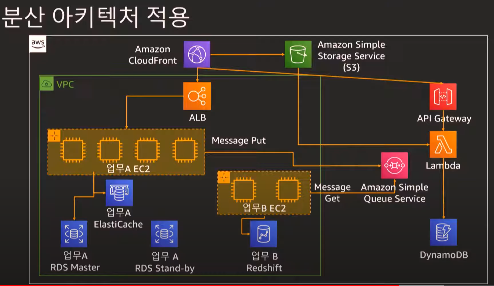

# 천만사용자를 위한 AWS 클라우드 아키텍처 진화하기

- <https://www.youtube.com/watch?v=z68l2X5KoC4&list=PLORxAVAC5fUWAd4oEEXU-PSb4LELpPA82&index=16>

서버 선정 및 이중화 구성

- 용도에 맞는 EC2 서버 선택
- 서버 멀티 AZ 구성
- Elsatic Load Balancing

DB 구성

- RDS 사용 지원

## 기본 구성

cognito를 이용한 빠른 인증 구현
code pipeline서비스를 통해서 commit build가능

---

# 사용자가 많아지는 경우

- EC2 autoscailing
- DB 고가용성 RDS 다중 AZ 배포
- AWS Backup 서비스도 있음
- cloudwatch를 활용한 모니터링
- cloudfront
- 읽기 복제본 오토스케일링
- ElastiCache
  - 1ms 응답속도
  - cache와 rds 복제 까지 구현
  - 

---

# 수십만 사용자

- loosely coupled, 분산 아키텍처
  - SQS pull 방식
  - SNS push 방식
  - 자동으로 관리
- 서버리스 아키텍처
  - Lambda
  - 이벤트 기반 아키텍처
  - 내부적 스케일링
- 분산 시스템 모니터링
  - X-Ray
- 분산 아키텍처 베스트
  - 

---

# 수백만 사용자

- 재해복구와 멀티 리전 시스템 고려
  - s3 / RDS 교차리전 복사

---

# 수천만 사용자

- aurora/dynamodb 글로벌 데이터 베이스

quick reviw

- cloudforamtion
- 용도에 적합한 데이터 베이스
- loose coupling
- 멀티리전
