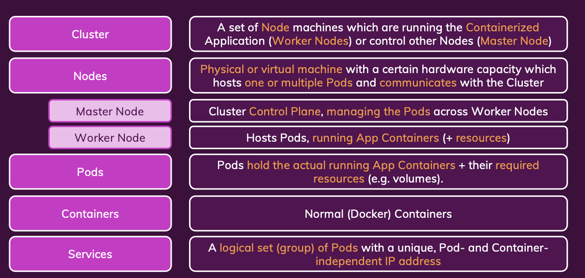

# SEC11 Kubernetes 시작하기

---

## Kubernetes란?

---

- 컨테이너 배포시 문제
  - 인스턴스 유지관리 문제
  - 컨테이너 충돌 및 장애
  - 컨테이너 스케일 인/아웃
  - 트래픽 분산
- Why k8s?
  - ECS 에서도 위와 같은 컨테이너 배포 문제를 해결하고 있음
    - LB, Auto Scaling, Health Check, etc...
    - 하지만 서비스에 Lock-in 되어있음 ex) AWS CLI, Console
- What is k8s?
  - 컨테이너 오케스트레이션 도구
    - 컨테이너화된 어플리케이션의 배포, 확장 및 관리를 자동화 하기위한 오픈 소스 시스템
  - k8s config를 통해서 클라우드 프로바이더에 관계없이 컨테이너를 배포하고 관리
  - 특징
    - 오픈소스
    - 서비스가 아님
    - 컨셉과 툴의 집합체임
    - 도커의 대체제가 아니고 컨테이너와 함께 동작함
  - docker-compose multiple machine
- 개념
  - 
  - Cluster
    - Node: VM or Physical Machine
    - Master Node
      - 마스터 노드에서 Control Plane을 통해 워커노드를 관리함
      - API Server
        - Kublets로 워커노드와 통신
      - Scheduler
        - Pod 관찰
        - 새로운 Pod이 배포될 워커노드 선택
      - Controller Manager
        - 워커 노드 전체를 감시하고 관리
        - Pod 개수 체크
      - etcd
    - Worker Node
      - 워커노드를 스케일 인/아웃 하면서 트래픽에 따라 Pod을 생성하고 삭제하며 워크로드를 분산함
      - Pod마다 다른 태스크를 수행할 수 있음
      - Kubelet
        - 워커노드와 마스터노드 사이의 통신을 관리
      - Kube Proxy
        - 네트워크 프록시와 로드밸런싱을 관리
      - Container Runtime(Docker)
        - 컨테이너를 실행하고 관리
    - Pod
      - 컨테이너의 집합
      - 워커노드내에서 실행
- k8s가 하는 일
  - pod을 생성하고 관리
  - 모니터링하고 스케일링
  - configuration파일을 배포하고 업데이트
- 내가 해야할 일
  - 클러스터(노드) 생성
  - API Server, Scheduler, Controller Manager, etcd, Kubelet, Kube Proxy, Container Runtime 설치
  - File, Network, Storage 설정
- 중요 용어 & 개념
  - 

## Kubernetes 설치 및 설정

---

- 개요
  - k8s의 클러스터와 노드생성은 사용자가 해야함.
  - k8s는 포드 모니터링, 포드 스케일링, 포드 교체 등 오케스트레이션을 담당하며 인프라에 관심을 두지 않음. 이로 인해 OS업데이트, 네트워크 설정, 스토리지 설정 등을 사용자가 해야함.
  - kubermatic이나 eks 같은 관리형 서비스로 k8s설치와 설정을 단순화할 수 있음
  - 클러스터 생성
    - GCP, AWS, Azure, etc...
  - 노드에 필요한 서비스 설치
    - 마스터 노드에는 API Server, Scheduler, Controller Manager, etcd
    - 워커 노드에는 Kubelet, Kube Proxy, Container Runtime(Docker)
  - kubectl
    - deployment를 생성하고 관리하는 CLI
  - 로컬에서 k8s 클러스터를 실행 minikube로 진행
  - kubectl은 minikube에 상관없이 사용 가능
- 설치

  ```bash
  brew install minikube
  minikube start --driver=docker
  minikube dashboard
  ```

## k8s 객체(리소스)

---

- pods
  - 하나 이상의 컨테이너를 포함하는 가장 작은 단위
  - 볼륨같은 리소스를 공유
  - 기본적으로 내부 IP를 가지고 있어 localhost 주소를 사용하여 서로통신할 수 있으며 외부와도 통신할 수 있음
  - **임시적**임. 컨테이너가 종료되면 데이터가 사라짐
  - 쿠버네티스에게 pod의 제거, 교체, 배포를 맡기고 pod의 객체를 직접 보내는 것이 아닌 **deployment를 통해 pod을 생성하고 관리**함
- deployments
  - pod의 수와 컨테이너 수에 대한 지침을 제공
  - 목표 상태만 정의하고 나머지는 k8s에게 맡김
  - deployments를 수정하고 삭제해도 k8s가 관리하고 있는 pod은 변경되지 않음
  - 메트릭을 통한 자동 스케일링 가능
  - pod을 직접 관리하는 것은 아님
  - 실습

    ```bash
    kubectl create deployment first-app --image=kub-first-app
    kubectl get deployments
    kubectl get pods
    kubectl apply -f deployment.yaml
    ```

    - 이미지를 dockerhub으로 올려야 minikube에서 사용가능
  - 작동 배경
    - deployment 생성 명령어를 통해 k8s master node(control plane)에게 deployment를 생성하라고 요청
    - master node의 scheduler가 deployment를 관찰하고 새로운 pod을 배포할 워커노드를 선택
    - 워커노드는 kublet 서비스를 통해 master node와 통신하고 pod을 생성
- services
  - pod에 실행되는 컨테이너에 접근하려면 필요
  - 내부 IP기 때문에 외부에서 접근 불가하고 pod이 교체되면 IP가 변경되는 문제가 있어 내부 IP를 사용할 수 없음
  - 서비스 그룹은 pod을 그룹화하고 공유 IP를 제공. IP는 변경되지 않음
  - 서비스 그룹은 외부에서 접근할 수 있는 IP를 제공하고 이를 통해 pod에 접근할 수 있음
  - 실습: service로 deployment 노출 시키기

    ```bash
    kubectl expose deployment first-app --type=LoadBalancer --port=8080
    kubectl get services
    minikube service first-app -- minikube에서만 동작함. 실행중인 서비스를 브라우저로 열기
    ```

    - minikube에서는 로컬 머신에서 실행되는 가상머신이여서 LoadBalancer는 pending상태로 유지됨. 실제 클라우드에서는 외부 IP를 제공함
- volume
- 명령적 vs 선언적
  - 명령적: 명령어를 통해 직접 실행
  - 선언적: 파일을 통해 실행
- scailing
  - pod이 중지되면 replicas 숫자에 맞춰서 새로운 pod을 생성함
  - 수동 스케일링

    ```bash
    kubectl scale deployment first-app --replicas=3
    ```
