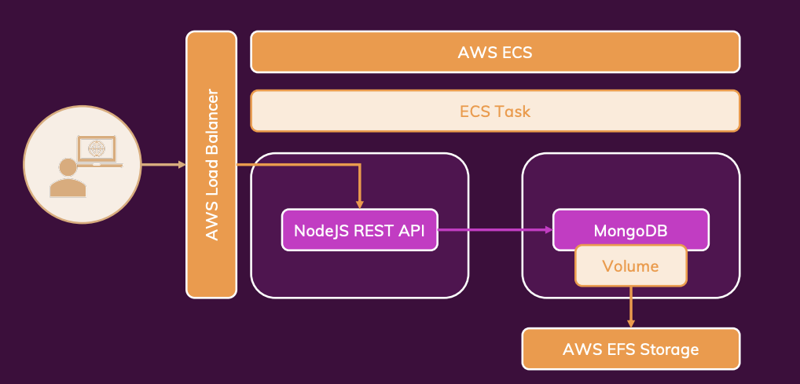
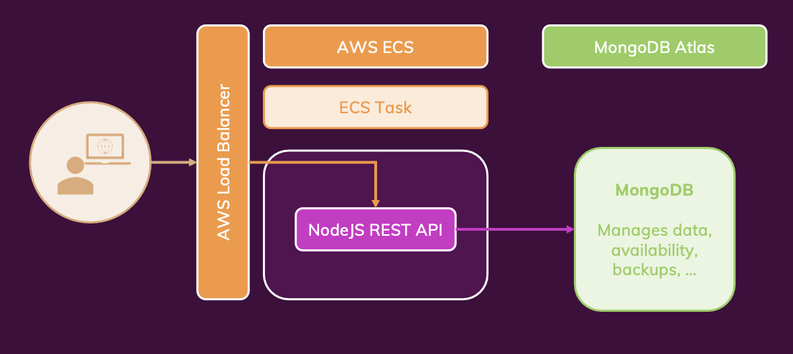

# SEC9 Docker 컨테이너 배포하기

---

## 모듈 소개

---

- 로컬 머신에서 동작하는 것을 리모트 머신에도 동작하도록 하기
- 주의할 점
  - 바인드 마운트 사용하지 말기
    - 컨테이너는 런타임 환경을 캡슐화해야하지만 코드는 캡슐화할 필요가 없음
    - 로컬호스트에 코드를 바로 실행하고 수정하면 즉각적으로 반영됨
    - 리모트 머신은 코드를 가지고 있으면 안됨. 그래서 바인드 마운트 대신 copy를 사용함
    - volume 옵션을 사용한 이유는 Dockerfile에서 명시하지 않기 위해서 였음
  - 컨테이너화된 앱에는 빌드 단계가 필요할 수 있음
  - 멀티 컨테이너 프로젝트는 여러 호스트 / 원격 머신에 분할되어야 함
  - 호스트/원격 머신 제어와 책임사이의 균형을 맞출 가치가 있을 수 있음
- SSH


## AWS EC2 배포

---

- 대부분 아는 부분이라 빠르게 넘김
  - VPC + 보안그룹 구성
  - EC2 생성
  - SSH 연결
  - Docker 설치
- 배포에 2가지방법
  - 소스코드 배포
    - 리모트 머신에서 이미지를 빌드
  - 이미지 배포
    - 호스트 머신에서 이미지를 빌드
    - 리모트 머신에서는 이미지를 가져와서 실행
- `.dockerignore` 파일을 사용해서 빌드할 때 불필요한 파일을 제외할 수 있음
  - `.gitignore`와 비슷한 역할
  - `node_modules`를 제외하고 빌드하면 빌드 시간이 단축됨
- docker hub에 배포
  - docker build
  - docker tag
  - docker push
- docker hub 이미지로부터 run하기
- 보안그룹 허용
  - 아웃바운드는 전부 허용되어 Docker Hub와 통신 가능
  - ssh 인바운드 규칙은 열려고 키파일로 접근 가능
  - 80 포트로도 접근할 수 있도록 인바운드 규칙 추가
- 도커설치만으로 컨테이너를 바로 띄울 수 있었음
- 이미지 및 컨테이너 관리
  - 수정하여 빌드하고 푸쉬한 새 이미지를 사용하기 위해선 `dockuer pull` 작업을 거쳐야 함
- 단점
  - do it yourself
    - 수동으로 생성 및 연결 했음
    - 서버의 책임은 본인에게 있음 ex) 보안그룹
    - ssh 연결도 해야함

## AWS ECS 배포

---

- control과 responsibility간의 균형을 잘 맞추면서 사용해야 함
- 완전 관리형 서비스
  - 리모트 호스트를 직접관리하지 않기 위함
  - 생성, 관리, 업데이트, 모니터링, 스케일링이 단순화 됨
- ECS
  - 더이상 도커 설치 및 명령어를 사용하지 않음
  - 콘솔로 설정
    - container name
    - Docker hub image name
    - port mapping 80 - 내부 외부포트가 동일하게 매핑됨
    - environmet variables는 --env 로 설정했던 내용들
    - storage and logging은 볼륨과 로그를 설정하는 부분
  - 태스크는 여러 컨테이너를 가질 수 있음
  - Fargate로 수행
  - 클러스터(=네트워크) 는 default로 생성
- 업데이트
  - 최신 이미지를 Docker Hub에 푸쉬
  - `Create new revision` 버튼을 누름
    - 새로운 revision을 만들지 않으려면 업데이트 버튼을 누름

## 다중 컨테이너 앱 배포

---

- 동일한 태스크에 컨테이너를 여러개 생성해서 동일한 네트워크에서 수행되게 하기
  - 동일 태스크내 컨테이너간의 통신은 localhost로 할수 있음
  - 개발은 MONGODB_URL을 mongodb이름을 사용하고 프로덕션 ECS에서는 localhost를 사용
  - MONGODB_URL은 env에서 가져와
- 로컬/프로덕션에 따라 명령어를 달리 하기
  - 로컬에서는 `npm start`
  - 프로덕션에서는 `node,app,js`
- environment variables
  - `Docker Compose`에서는 `env_file` 사용
  - 프로덕션에서는 ECS에서 직접 key-value형태로 입력
- 로드밸런서
  - ECS 서비스 상태를 확인하여 응답을 받지못하면 재시작함
  - Helath Check 경로를 `/goals`로 설정
  - 로드밸런서 보안그룹에 ECS 서비스에서 사용하는 보안그룹 추가
  - ELB주소로 접근할 수 있음
- `Force new deployment`를 체크하면 새로운 revision을 만들어서 배포함
- EFS 
  - 기존 Docker 컨테이너처럼 데이터가 컨테이너 종료와 함께 사라지는 문제를 해결
  - VPC는 ECS에 동일하게하고 보안그룹에 NFS(2048)포트와 ECS에 사요오디는 보안그룹 추가
  - ECS에서 data volume에서 EFS를 선택하고 마운트포인트를 `/data/db`(컨테이너 경로)로 설정
  - mongodb를 새로 배포하다 보면 두개의 컨테이너가 EFS 동일 파일에 접근하려다 보니 Lock이 걸림
    - 태스크를 중지후 재시작하여 해결되었으나, 근본적인 해결책은 아님
- 현재까지 구축한 아키텍처
  - 

## MongoDB Atlas로 이관

---

- DB를 컨테이너로 관리할 시 문제점
  - 가용성을 확장하고 관리하기 어려움
  - 트래픽 급증시 성능 문제가 발생
  - 백업과 보안에 신경써야함
- managed service와 직접 관리하는 것에는 Trade-off가 있음
- mongdob atlas로 시작
  - free tier로 만듬
  - connect버튼에서 나오는 연결정보로 변경
  - 동일 클러스터에서 다른 DB를 사용하여 개발환경과 프러덕션환경을 구분
  - Dockerfile에서 monngodb를 사용하지 않고 env 파일과 사용하지 않고 URL도 변경하여야 함
  - `Network Access`에서 IP를 추가해야함
  - `Database Access`에서 사용자를 추가해야함
- 프로덕션에서 활용
  - 기존 Mongodb 컨테이너 삭제
  - 환경변수 atlas것으로 변경
  - 

## React SPA 컨테이너 실행

---

- react
  - `npm start`를 수행하면 개발서버가 실행되고 변경사항이 있을 때마다 새로고침됨. 하지만 실환경에서는 이 커맨드를 사용할 수 없음
- `Dockerfile.prod` 파일을 만들기
  - node alphine 이미지를 사용
  - `npm run build`를 수행하도록 함
- **멀티 스테이지 빌드**
  - `CMD` -> `RUN` 명령어로 변경하고 그 후에 nginx 이미지를 사용하여 멀티스테이지 빌드를 수행
  
  ```dockerfile
  FROM node:14-alpine as build

  WORKDIR /app

  COPY package.json ./

  RUN npm install

  COPY . .

  RUN npm run build

  FROM nginx:stable-alpine

  COPY --from=build /app/build /usr/share/nginx/html

  EXPOSE 80

  CMD ["nginx", "-g", "daemon off;"]
  ```

- react 코드에 `localhsot` 부분들을 제거함
- Docker hub에 react 이미지를 빌드하고 푸시
  - `docker build -f frontend/Dockerfile.prod -t <dockerhub-id>/react-app ./frontend`
- 같은 80 port로 태스크를 생성할 수 없음
  - backend url을 env.NODE_ENV로 분기처리하여 개발환경이면 localhost주소 사용하고 프로덕션환경이면 LB주소 사용

## 멀티 스테이지 배포

---

- `--target` 옵션을 통해 빌드 스테이지를 선택할 수 있음
  - `docker build --target <stage-name> -t <dockerhub-id>/react-app ./frontend` 
