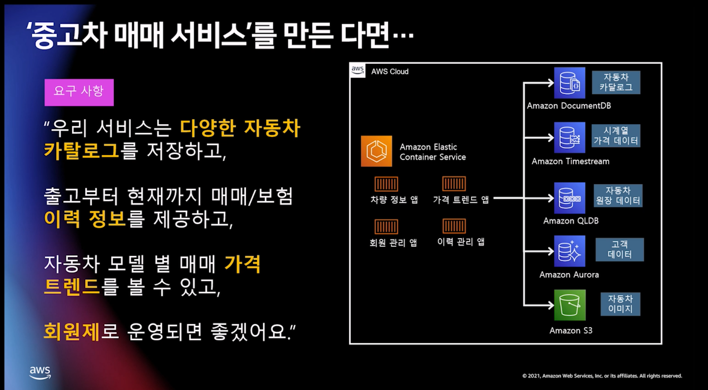
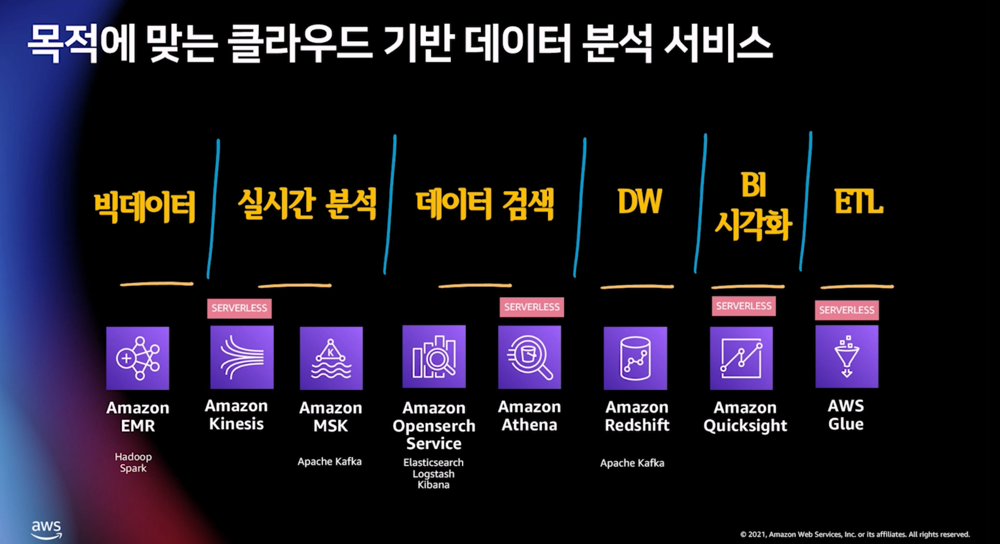

# 클라우드

## 1. 목적 기반 데이터 저장/분석 도구

- 다양한 목적에 따흔 DB가 있음
- 하나의 서비스에도 아래와 같이 여러 DB를 쓸 수 있음

  - 

- 데이터 분석 서비스 종류
  - 
  - EMR
    - 표준 스파크보다 1.7qo Qkfmstjdsmd`
    - Arm기반 인스턴스
    - 컨테이너
    - IDE 연동

## 2. 유연한 데이터 이동성

- 데이터 레이크
  - 정의: 데이터레이크는 정형 혹은 비정형 데이터에 상관 없이 어떤 규모에서도 저장 및 분석이 가능한 단일 저장소
  - S3
  - AWS Glue

## 3. 통합 데이터 거버넌스

- AWS Lake Formation
  - 각 서비스 간에 데이터 이동이 쉽고 s3로부터 중앙 연결이 되어 잇음

- ## redshift

## 4. AI 기반 비즈니스 통찰력

- aurora ml
  - comprehend에 에다가 API 호출 가능함
- athena ml
  - SQL 쿼리에서 ML 모델 호출
  - sagemaker 모델을 뽑아서 결과를 볼 수 있음
  - 재가
