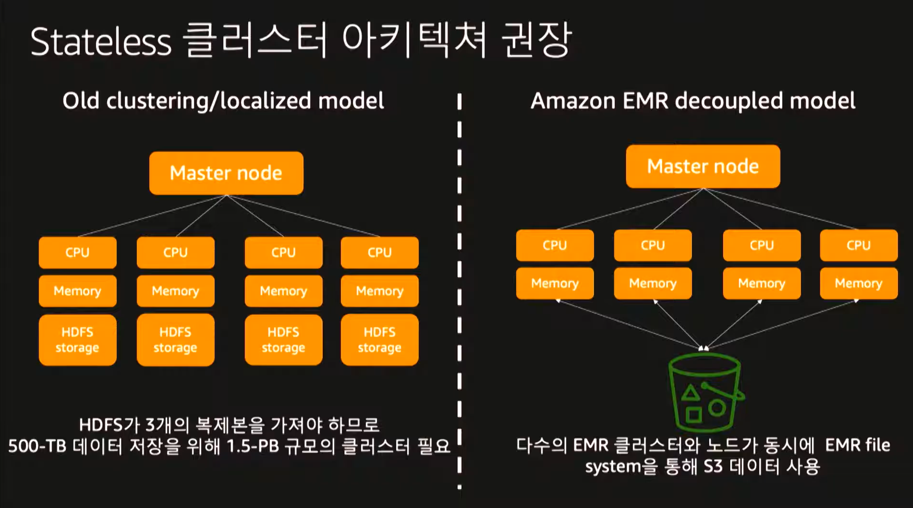
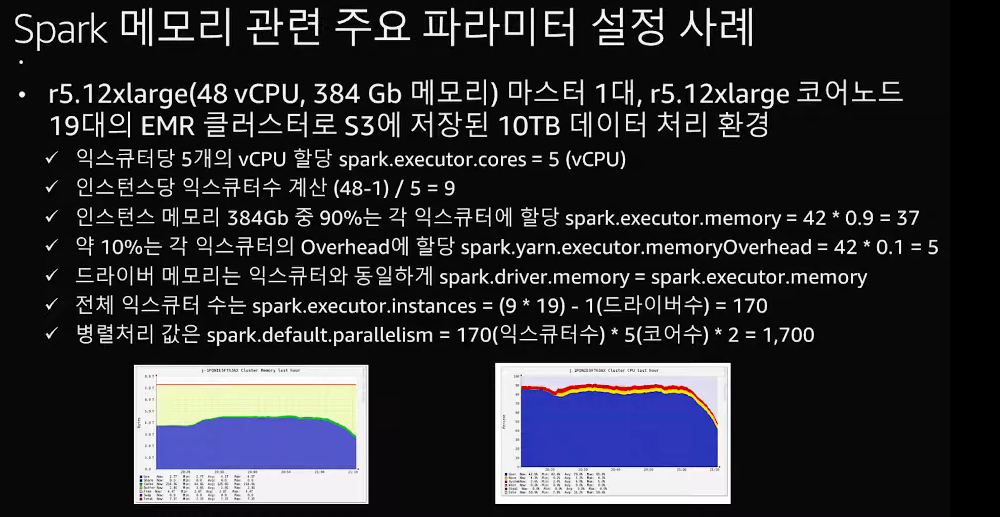

# EMR 플랫폼 기반의 Spark 워크로드 실행 최적화 방안

- <https://www.youtube.com/watch?v=hPvBst9TPlI&list=PLORxAVAC5fUWAd4oEEXU-PSb4LELpPA82&index=36>

## Spark on EMR

- 마스터 노드
- 코어 노드 = 데이터 노드
- 테스트 노드
- stateless 클러스터 아키텍처
  - 
- Spark 효울화
  - Spark 워크로드 최적화
    - 데이터 포멧 parquet
    - 스캔 범위 최소화 - partition
    - data skew - partition key나 push down 설정등 조정
  - 메모리 최대한 효율적 사용
    - 캐싱 사용
    - 적절한 spark설정값
    - partition
  - 조인 및 셔플링 최적화
  - 적절한 환경 변수 설정
    - 익스큐터 개수 / 코어수 / 메모리
- 주요 이슈
  - jaba heap 메모리
  - 가상 메모리
  - executor 메모리
  - 주요 파라미터는 executor core 와 memory
    - 베스트 프랙티스
    - 

- 성능 최적화
    1. Dynamic partition Pruning
        - 정확한 데이터만 읽고 처리
    2. Flattening Scalar Subqueries
        - 다수개의 서브쿼리를 하나의 쿼리로 처리
    3. Distinct Before Intersect
        - 조인전에 데이터 개수를 줄여줌
    4. Bloom filter join
        - 조인전에 filter 기능 1번과 별개 필터
    5. optimized join reorder
        - 데이터 규모에 따라 재정렬 하여 소규모 쿼리를 먼저 실행
    6. s3를 통한 spark 성능 향상
        - EMRFS multipart와 parquet이 가능할경우 성능 향상
    7. s3 select 데이터 필터링
        - s3에서 사전 필터 적용 가능

## EMR Runtime for Apache Spark

- 성능 향상이 잘 됐다.

## Datra lake 운영

- 증가하는 업데이트의 데이터의 경우 Slow Data Lake 이슈를 확인
- 빈번한게 변경되는 데이터 관리에 용이
- Apache Hudi(Hadoop upserts and incrementals)
  - copy on write
    - read-optimized는 전체 값
    - incremental은 직전 커밋에 바뀐 값
    - 작고 꾸준히 수정되어야 하는 워크로드 + parquet
  - merge on write
    - real time은 wjscp rkqt
    - incremental은 직전 커밋에 바뀐 값
    - Read-Optimized
    - 대부분 이거 사용, 최대한 빠르게 쿼리가 필요할 때

## EMR Managed resize

## Spark history

    - 마스터노드 ssh접근하여 확인
    - s3 athena로 확인

## Docker환경에서 spark 실행

- CLI에서 docker이미지로 실행가능
