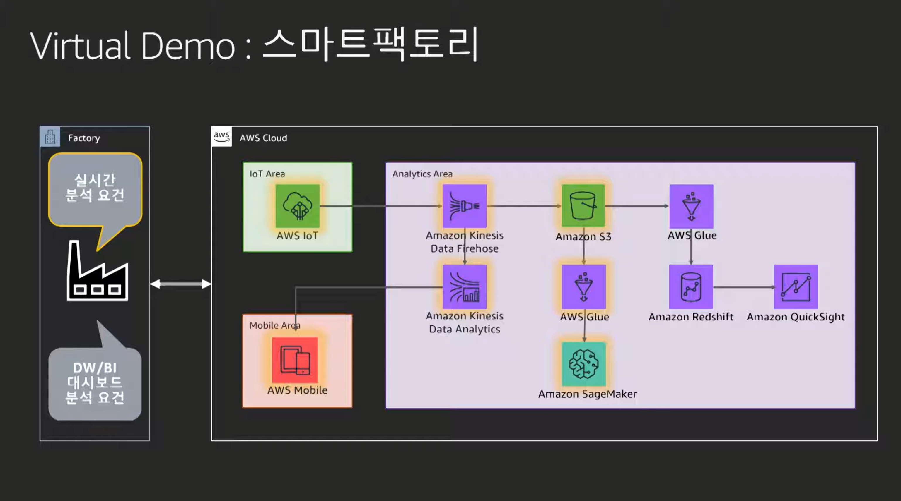
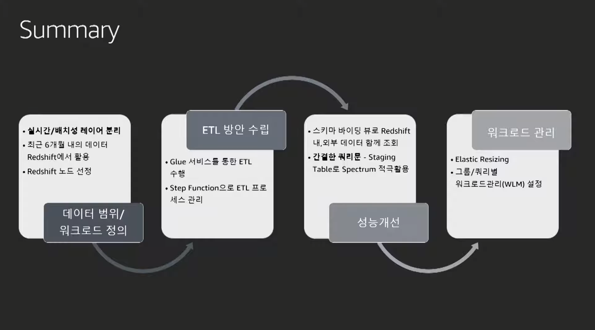

# Data Lake 환경에서 Amazon Redshift Spectrum을 이용한 대량 데이터 활용
- https://www.youtube.com/watch?v=4tTMrKwpeuQ&list=PLORxAVAC5fUWAd4oEEXU-PSb4LELpPA82&index=38

## Amazon Data Warehouse Service
- 기존 DW 문제
    - 다양한 소스 데이터 수집
    - 스케일 아웃
- 클라우드 기반의 웨어하우스
    - 다양한 포맷의 소스 데이터 지원
    - 탄력적인 클러스터 사이즈 확장 및 축소
    - 

## 피드백
- 데이터 저장소 부족
    - 클러스터 확장
    - s3 성능 관리 불편
    - s3 기반의 데이터 레이크로 데이터 통합이 가능
        - redshift spectrun
        - EMR/sagemaker에서 활용 가능
- 적합한 ETL 워크플로
    - ETL Glue
        - spark job
        - python shell job
    - Step Functions
        - json 형식의 서버리스 워크플로우
    - ohchestrate ETL job
        
- 클러스터 확장에 대한 고민
    - redshift spectrum fleet
    - concurrency scailing
        - wait발생하면 추가 클러스토 자동 확장
    - elastic resizing
        - 피크 타임시만 노드 증설 가능
- 성능에 대한 오해
    - 인덱스 적음
        - 인덱스가 다양하지 않음
        - 파티션 테이블 지원 X
    - spectrum은 항상 느리다.
        - hash join -> agg -> sort + limit
        - s3에서 partition pruning이 중요
        - 10M 미만의 적절한 파일 사이즈
        - 중간 스테이징 테이블 활용
        - 대량 데이터 DML 문 실행
    - 운영 어렵
        - 테이블 키나 VACCUM 관리 Auto모드
        - 모니터링은 cloudwatch + advisor 
- 신규 기능
    - RA3 노드 타입
    - AQUA(Advanced Query Accelerator)
    - 구체화된 보기

## CASE study
- 실시간 배치 두부분으로 나눔
- 
- 데이터 레이크와 결합
    - 바인딩 뷰
    - 성능 개선 포인트
        - 여러 단계 조인은 지양
        - staging 테이블을 활용하여 spectrum fleet을 하여 조회
        - 구체화된 뷰에 미리 되어있는 데이터 사용 ra3.4xlarge 
- scailing
    - elastic resizing (RI에 적용 부락?)
- 
