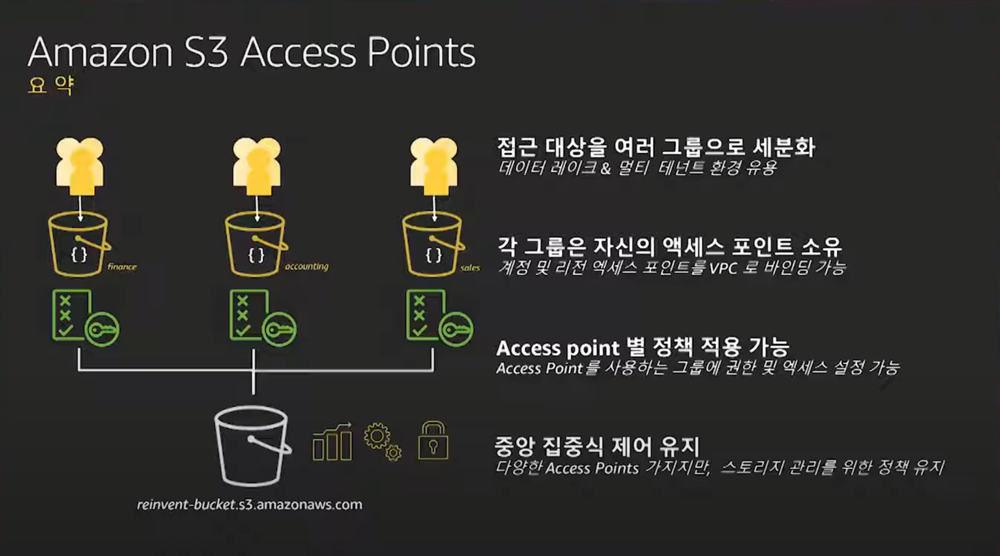

# S3, 넌 이것까지 할 수있네 (Amazon S3 신규 기능 소개) -

- <https://www.youtube.com/watch?v=U3vSKefs75c&list=PLORxAVAC5fUWAd4oEEXU-PSb4LELpPA82&index=26>

## 비용 절감

- storage 클래스 조정
  - intelligent-Tiering은 자동으로 조정
    - 30일 동안 접근하지않으면 infrequent access
  - deep-archive
  - inventory reports

## 보안 및 접근

- block public access
- access analyzer for s3
- s3 access points
  - 
  - 접근 권한을 제어할 때 유용할듯

## 데이터

- s3 batch operations
- s3 replication
  - 동일리전 복제
- time control
