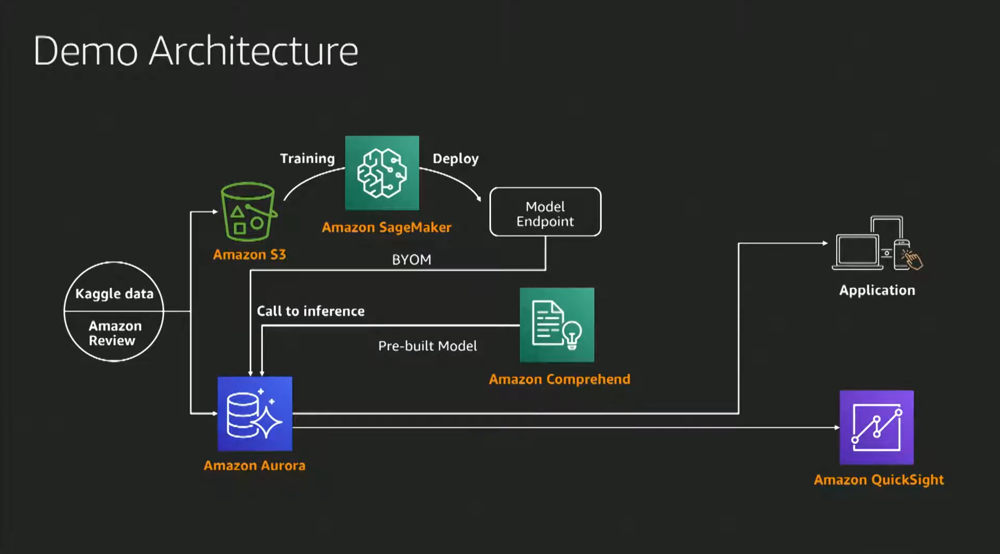

# 아직도 파이썬으로만 머신 러닝 하니? 난 SQL로 바로 쓴다.
- https://www.youtube.com/watch?v=-SRPci88WCM&list=PLORxAVAC5fUWAd4oEEXU-PSb4LELpPA82&index=22
- 10분 부터 관련 내용 나옴

## 기존 inference 프로세스
- 

## 제안하는 inference 프로세스
- 
- 예시
    - 
- 데모
    - 
    - aurora
        - role에서 sagemaker랑 comprehand 권한 줘야함
        - 파라미터 그룹을 통한 멀티 role
        - function 정의 후 엔드포인트 사용
    - ec2 - mysql 접속 및 s3 로드용
    - sagemaker
        - endpoint 설정 후 

=> sagemaker에서 기존 데이터 모델을 올릴 수 있는지가 핵심일듯
- sagemaker endpoint 호출

