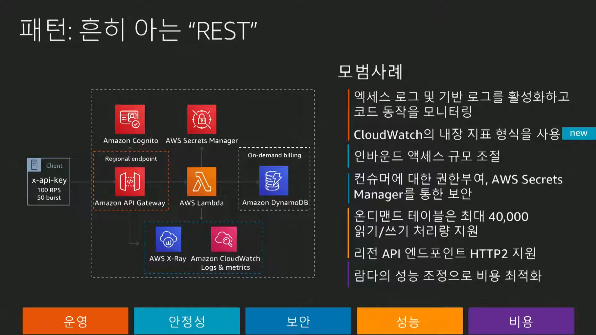
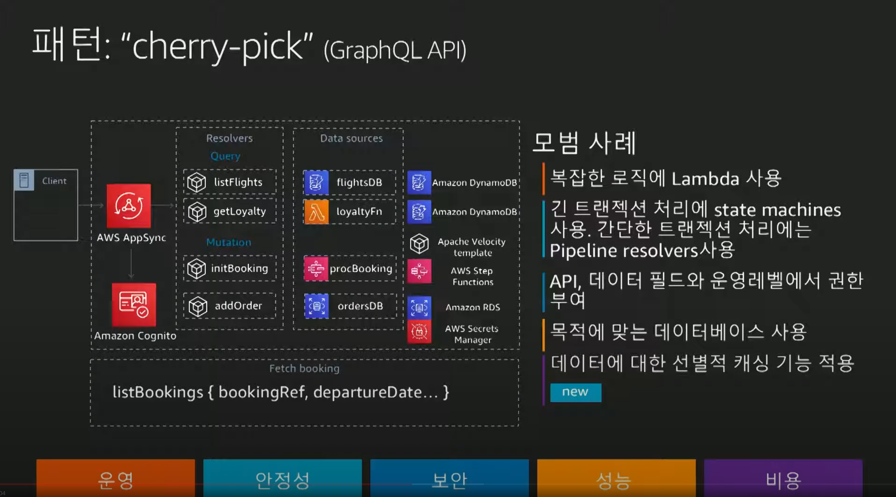
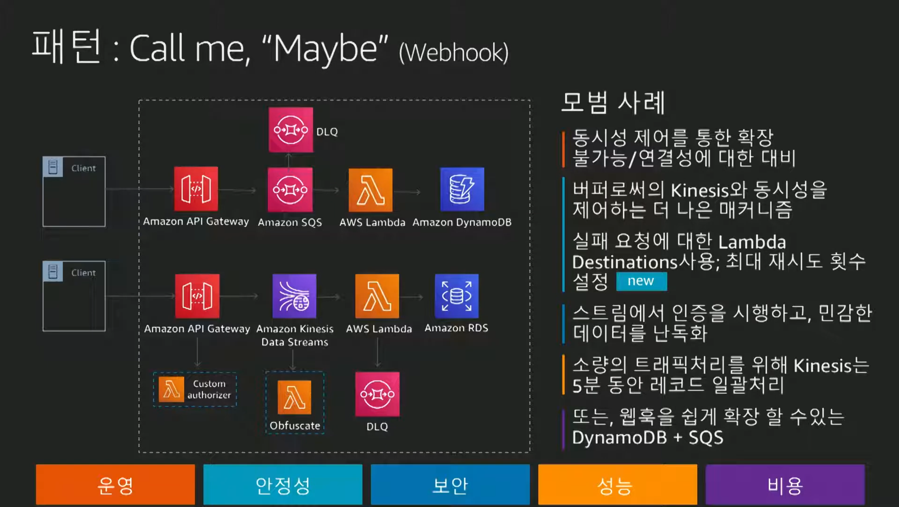
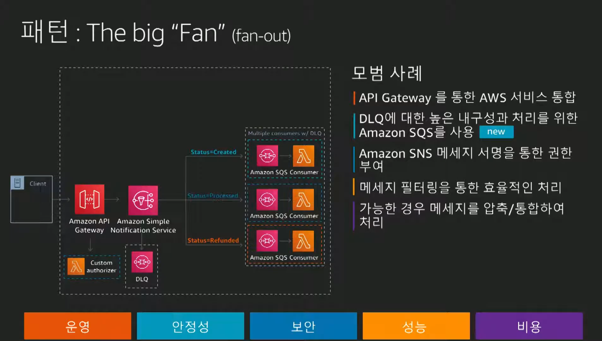
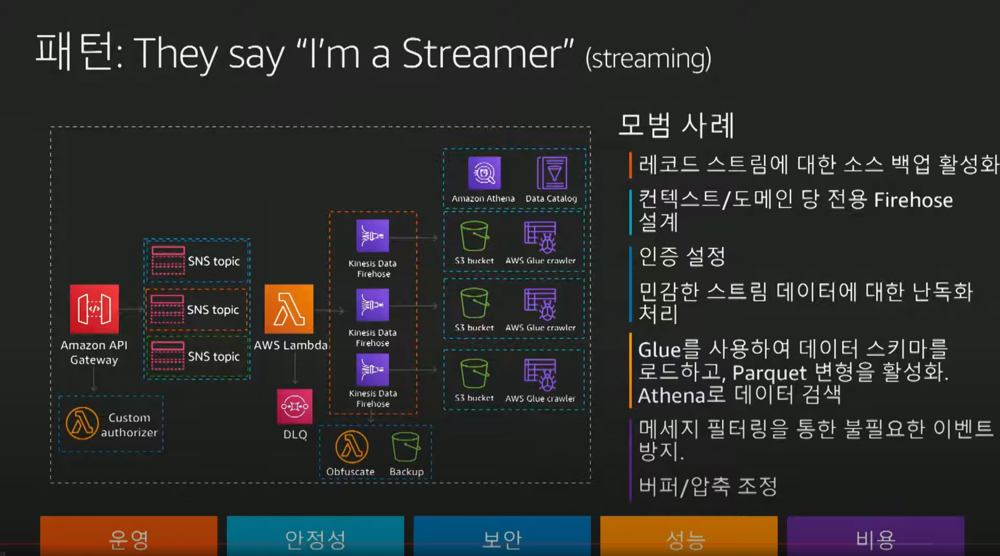
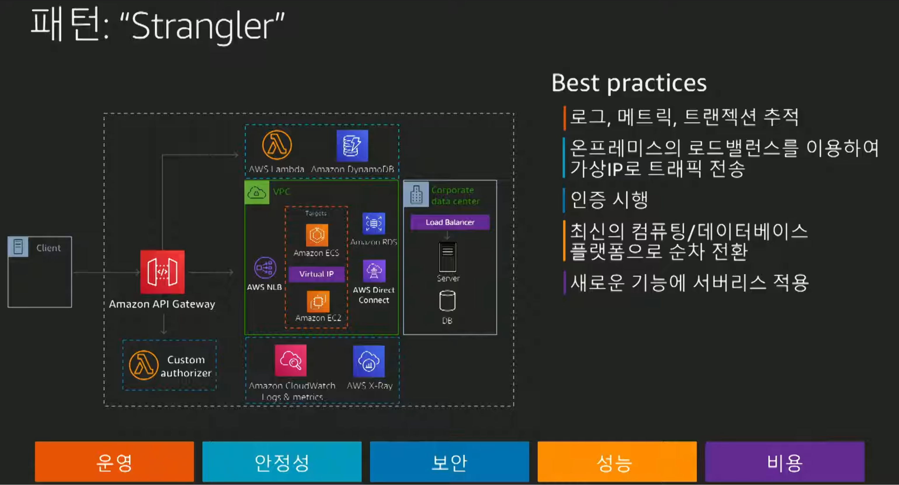

# 서버리스 아키텍처 패턴 및 모범 사례
- https://www.youtube.com/watch?v=sJfl339Y_y4&list=PLORxAVAC5fUWAd4oEEXU-PSb4LELpPA82&index=21

---

## REST API 패턴
- 

## cherry pick 패턴
- GraphQL API
- 

## Webhook 패턴
- 

## fan-out 패턴
- 
- 256kb 바이트의 제한이 있어 데이터의 크기가 크면 kinesis로 고려
- java client의 경우만 2gb가능

## streaming 패턴
- 

## Strangler 패턴
- 
- 온프레미스와 결합할 때 주로 사용하는 패턴

---

## 정리
- Airline 예재로 서비리스 다수의 패턴과 사례를 파악할 수 있음