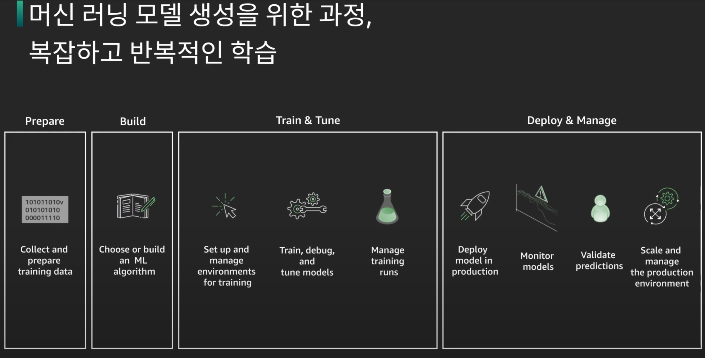
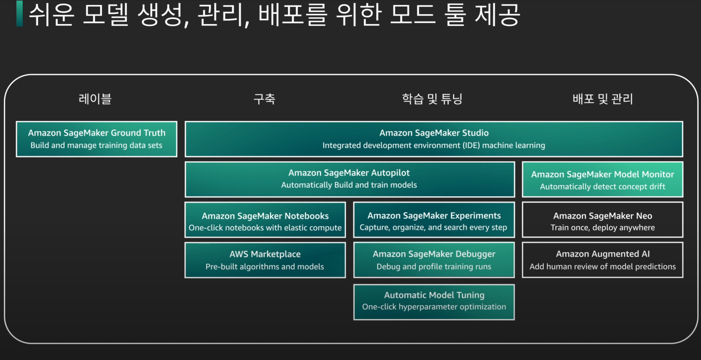
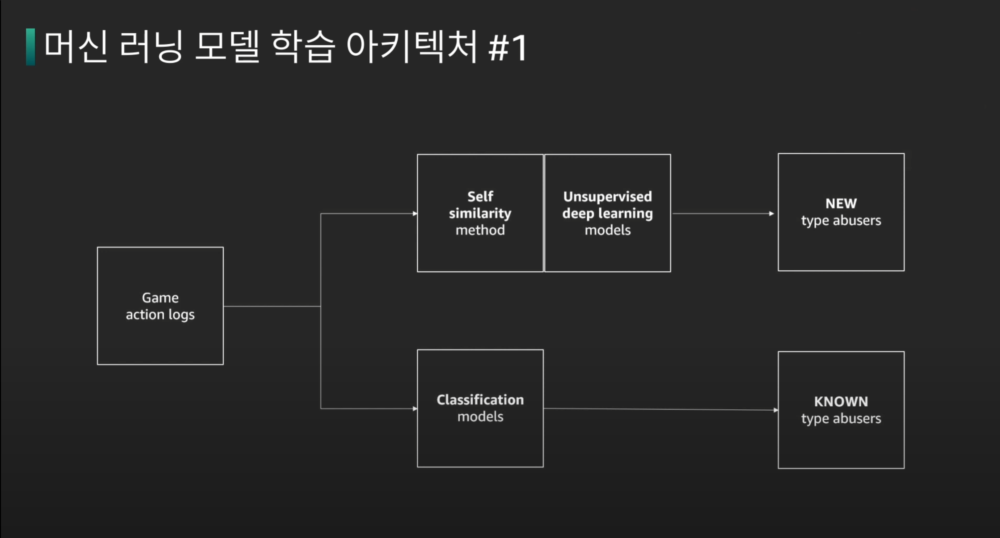
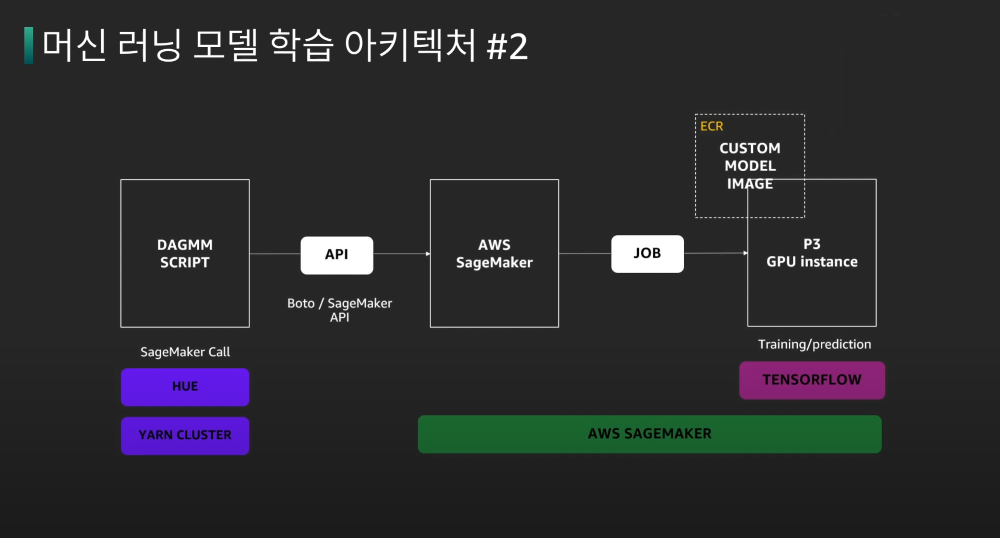
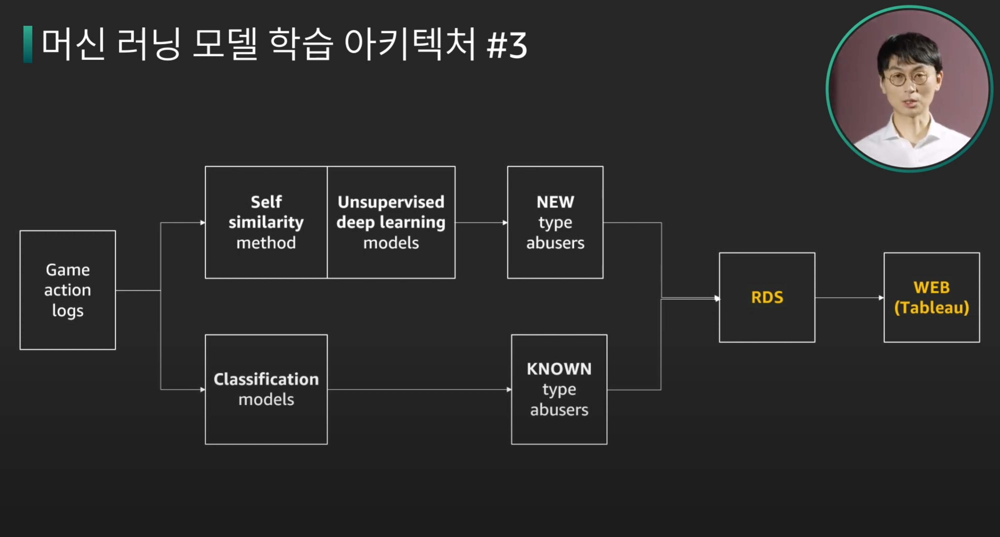

# 게임 개발에 적용해보자. 머신 러닝과 인공 지능

링크 - <https://www.youtube.com/watch?v=DjyAhe9hM-4&list=PLORxAVAC5fUUsx6EeahxsZYYbuSxe6IFr>

비즈니스적인 내용을 위주로 다룹니다.

### Q. 우리는 언제 게임에 AI/ML에 적용할 수 있는가?

에 대한 대답을 주로 합니다.

---

## AWS AI 서비스

AWS AI 서비스는 API처럼 바로 쓸 수 있는 매니지드 서비스이다.

- Amazon Translate: 전자동 번역기능
- Rekognition: 이미지 detection, 사진 필터 기능(커스터 마이징 가능)
- Polly: Text-to-Speech
- Comprehend: 게임 내 텍스트로 감정 분석, 버그 해킹 불만 등을 찾아내기 위함
- Personalize: 추천 서비스

AI 사례

1. AI 매치 메이킹 - 스킬이나 레벨 등 다양한 변수를 통한 적절한 매칭
2. AI 게임 QA 테스팅 - 제한적인 시나리오에서 벗어난 다양한 Bot으로 테스트
3. AI NPCs - NPC를 개인화 및 다양성있게 연출
4. AI 게임 레벨링 또는 난이도 조정 - 다양한 난이도 연출
5. 게임 내 이상 탐지(Abnormal detection) - 어뷰징, 에임 핵 탐지

## SageMaker

- ML 서비스: ML 모델을 빠르게 구축, 훈련 및 배포할 수 있도록 하는 완전형 서비스

- 
- SageMaker Ground Truth
  - 데이터 셋을 레이블링 하는 작업
- SageMaker Studio
  - IDE
  - Autopilot: 자동 빌드와 훈련
  - SageMaker Notebooks: 다른사람과 노트북 코드 쉽게 공유
  - AWS maketplace: model 공유
  - SageMaker Experiments: 훈련 기록
  - Debugger: 훈련 디버깅
  - Automatic Model Tuning: 자동으로 하이퍼파라미터 튜닝
  - Model Monitor: 자동으로 모델 업데이트 요소 파악
    

---

## 고객 사례

### 게임 내 이상 감지 플랫폼(크래프톤)

- 새로운 어뷰징 타입을 찾는 플로우
- 기존 어뷰징 타입으로 어뷰징 유저를 찾는 플로우

- SageMaker에서 GPU인스턴스를 통한 빠른 학습

- 1번 아키텍처에서 RDS로 데이터를 넣고 BI에 표시

=> 결과

- 12개의 새로운 어뷰징 발견
- 250개의 어뷰징 케이스를 발견하여 어뷰징탐지 많이함

### Fraud Detector

- 온라인 사기 감지 매니지드 서비스
