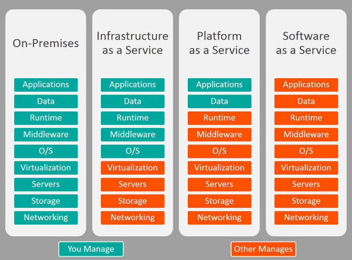

# CH1 네트워크의 기본

## 1-1 컴퓨터 네트워크

- 네트워크의 정의
  - 컴퓨터끼리 데이터를 주고받는 시스템
- 네트워크를 이용하는 목적
  - 정보 수집
  - 문서 파일 공유
  - 커뮤니케이션
  - ERP 업무

---

## 1-2 사설 네트워크와 인터넷

- 네트워크의 분류
  - 사설 네트워크
    - 사용자가 제한됨
  - 인터넷
    - 사용자 제한이 없음. but, 크래커들도 접속 가능

---

## 1-3 LAN과 WAN

- LAN과 WAN
  - Local Area Network는 각 거점의 네트워크
  - 거점 내의 PC나 서버의 통신이 가능
  - LAN(거점)끼리 연결한 것이 Wide Area Network
- 구축, 관리, 비용
  - LAN은 각 기기 배치나 배선 필요한 설정을 직접 구축하고 관리, 초기설정의 비용이 들어감
  - WAN은 통신사업자가 구축하고 관리, 서비스 초기계약 비용과 통신요금 발생

---

## 1-4 인터넷

- 구성 요소
  - 조직의 네트워크를 AS(Autonomous System)이라고 부름
  - NTT회사와 같은 ISP(Internet Service Provider)나 구글 아마존 같은 인터넷 상에서 서비스를 제공하는 기업 네트워크를 AS라 칭함
  - ISP의 최상위 그룹을 Tier1이라고 칭함. 인터넷 상 모든 ISP는 Tier1을 경유해서 연결됨.
- 인터넷 접속 서비스
  - 사내 네트워크의 라우터를 ISP의 라우터와 연결하면 인터넷 이용 가능
- 고정회선과 모바일 회선
  - 고정 회선
    - 전용선: 통신 속도 보장되지만 비쌈
    - 전화회선(ADSL): 전화회선을 이용해 저가에 인터넷 접속
    - 광케이블(FTTH): 고속
    - 케이블 TV회선
  - 모바일 회선
    - 4G: 휴대전화망을 이용한 광역인터넷 접속이 가능
    - WiMax
    - 무선 LAN(Wi-fi): wi-fi 액세스 포인트의 제한된 범위에서 인터넷 접속 가능

---

## 1-5 어플리케이션, 피어투피어 어플리케이션

- 데이터를 주고받는 주체
  - 주로 어플리케이션
  - 클라이언트와 서버의 통신이 주를 이룸
  - 요청 및 응답 구조
- 피어투피어 어플리케이션
  - 서버를 거치지 않고 클라이언트끼리 직접 데이터를 주고받는 어플리케이션
  - SNS온라인 메신저나 온라인 게임 등
  - 통신 상대를 지정하고자 서버가 개입하는 일도 있음

---

## 1-6 네트워크 아키텍처

- 통신을 위한 규칙
  - 프로토콜
    - 주소나 데이터 형식, 통신 절차 등의 규칙
  - 복수의 프로토콜을 조합해 하나의 네트워크 아키텍처가 됨
  - 아키텍처는 TCP/IP OSI Appletalk 등이 있음
- TCP/IP
  - 네트워크의 공통 아키텍처는 주로 TCP/IP
  - 역할별로 네 가지로 계층화된 복수의 프로토콜 조합
    - 어플리케이션 계층: HTTP DHCP POP3 DNS DHCP 등
    - 트랜스포트 계층: TCP/UDP
    - 인터넷 계층: IP, ICMP, ARP 등
    - 네트워크 인터페이스 계층: 이더넷, 무선 LAN, PPP등

---

## 1-7 Saas, Paas, Iaas

- 클라우드 서비스
  - 클라우드 서비스는 네트워크를 경유해 서버의 어느 부분을 사용자가 이용할 수 있게 함
  - 세가지 분류(Saas, Paas, Iaas)
    - IaaS
      - CPU 메모리 저장장치와 같은 하드웨어 부분을 이용
      - 자유롭게 시스템을 만들어 이용 가능
    - PaaS
      - 서버의 플랫폼 이용 가능
      - 플랫폼이란 OS와 OS 상에서 동작하는 데이터베이스등의 미들웨어를 포함한 부분
    - SaaS
      - 특정 소프트웨어 기능 이용
      - 온라인 스토리지 서비스
    - 

---