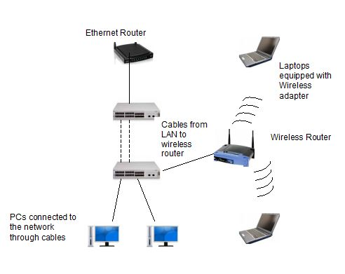

# CH2 네트워크를 만드는 것

---

## 2-1 클라우드 아이콘

- 네트워크를 어떻게 표현할 것인가?
  - 추상화하여 구름 모양의 클라우드 아이콘으로 기재
- 네트워크라 해도 규모는 제 각각
  - 가정에서 사용하는 소규모든 기업에서 사용하는 대규모든 규모는 다양함

---

## 2-2 네트워크 기기

- 기본적인 네트워크 기기
  - 아래 3기기들은 모두 데이터를 전송함.
    - 라우터
    - 레이어2 스위치
    - 레이어3 스위치
  - 데이터 전송 과정
    1. 데이터 수신: 물리적 신호를 0, 1로 전환함
    2. 데이터를 보낼 곳을 결정: 데이터에 부가된 제어정보로 전송처를 결정
    3. 데이터 전송: 물리적인 신호로 변환하여 데이터를 내보냄
  - 데이터를 어디에 보내는지가 중요

---

## 2-3 인터페이스(포트), 링크

- 인터페이스
  - 각각의 기기에는 각 기기를 연결하기 위한 인터페이스가 있음
  - 일반적으로 이용되는 것은 **이더넷 인터페이스**
  - 인터페이스는 종종 포트라고도 불림
- 전송 매체와 링크
  - 인터페이스 끼리 연결(링크)함
  - 인터페이스를 서로 연결하는 케이블을 **전송 매체**라고 부름
  - 전송 매체는 무선 전파인 경우도 있음
  - 다양한 기기의 인터페이스를 전송 매체로 연결해 링크를 구성함으로써 네트워크가 형성
- 인터페이스는 무엇의 경계일까?
  - 디지털 데이터와 물리적 신호의 경계
  - 디지털 데이터는 물리적 신호로 변환되어 인터페이스에서 송출되고 링크로 전달

---

## 2-4 LAN 구축

- LAN의 주요 기술
  - 이더넷
  - 무선 LAN(Wi-Fi)
- LAN의 구축
  - 이더넷 인터페이스가 있는 라우터와 레이어2 레이어3 스위치 등의 네트워크 기기 필요
  - 유선 LAN: 기기들의 인터페이스를 LAN 케이블로 연결해 가면 LAN이 구성됨
  - 무선 LAN: 무선 LAN 액세스 포인트(네트워크 기기)와 무선 LAN 인터페이스가 있는 기기(노트북 PC나 스마트폰)
  - 무선 LAN은 유선 LAN과도 연결될 수 있음 
  - 대략적인 구성도
    - 

---

## 2-5 네트워크 설계

- 네트워크 설계 프로세스
  - 기업 네트워크 같이 대규모 네트워크는 바로 만들기는 어려움.
  - 아래와 같은 **4단계의 네트워크 설계**가 필요
    1. 요건 정의
       - 네트워크에 요구되는 기능과 성능
       - 이용 목적
       - 데이터 양, 전송 방법
    2. 설계
       - 좁은 의미에서의 설계
       - 네트워크를 구성하는 기기
    3. 구축
       - 설계에서 결정한 네트워크 구성에 따라, 네트워크 기기 배치와 배선, 설정을 함
    4. 운용 관리
       - 매일 네트워크 기기의 상태를 점검
       - 원인 파악 및 복구 작업 관리

---

## 2-6 네트워크 구성도

- 네트워크 구성도의 종류
  - 논리구성도와 물리구성도를 정리
  - 논리구성도
    - 네트워크간의 연결을 나타냄
    - 기술적인 하나의 네트워크는 라우터 또는 레이어3스위치로 구분
    - 논리구성도의 핵심은 몇개의 네트워크가 어느 라우터와 레이어 3 스위치로 연결되는지 파악하기 쉽게 정리하는 것!
  - 물리구성도
    - 기기의 배치와 배선을 나타냄
    - 각 기기의 물리적인 배치와 각 기기의 인터페이스가 어떻게 연결되어 있는지 나타냄
    - 물리구성도의 핵심은 어느 기기의 어느 인터페이스가 어떠한 케이블로 배선되는지 파악하기 쉽게 정리하는 것
  - 물리구성도와 논리 구성도의 대응
    - 논리구성도와 물리구성도가 1대1로 대응하지는 않음