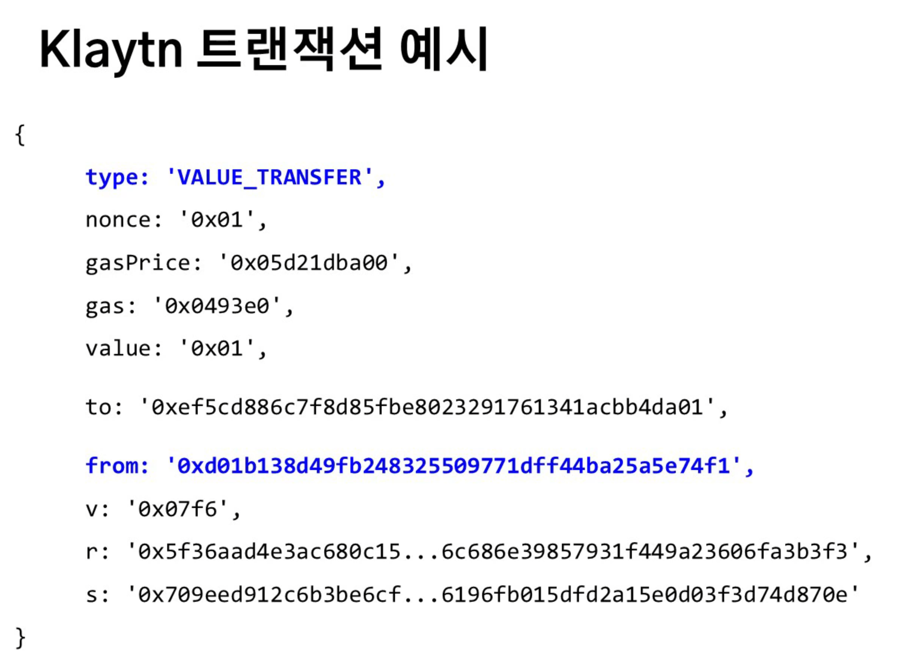

# SEC2_블록체인 상태와 트랜잭션

---

# CH1 Klaytn 합의 알고리즘

- BFT  
  - PoW가 너무 느리기때문에 BFT를 씀. PoS는 돈만내면 누군가가 과반을 차지하기 쉬운구조.
  - PoW로 시작하고 잘 분산되어잇다 판단되면 PoS로 변환하는게 대부분
- Klaytn도 BFT만의 특징
  - 네트워크 참여자가 작을수록 빠름
  - 전체집합을 거버넌서 카운실(Governance Council)
  - 부분집합을 커미티(Commirww)
  - **매 블록마다 새 커미티**를 뽑아 **BFT**를 실행
  - 기존의 BFT에 비해 확장성을 크게 개선

---

# CH2 블록체인의 상태

- 트랜잭션으로 변화하는 상태 기계(State Machine)
  - 초기값 + 변경 = 최종값
  - 이전블록 최종상태 = 현재블록 초기상태
- 상태기계
  - 블록체인의 상태로 기록되면 account가 생기고 smart contract가 생김(account를 만드는 것은 key pair를 만드는 것)
  - 항상 같은 결과를 보장하기위해 하나의 TX가 반영되는 과정에 다른 TX의 개입은 제한됨

---

# CH3 트랜잭션

- 어카운트의 종류
  - External: 사용자가 사용하는 어카운트 = **EOA**
  - Contract: **스마트 컨트랙트**를 표현하는 어카운트
- Ethereum은 EOA와 스마트 컨트랙트의 상태를 기록 및 유지
  - 스마트 컨트랙트는 특정 주소에 있는 **실행 가능한 프로그램**
  - 프로그램은 상태를 가지기 때문에 Ethereum/Klaytn은 스마트 컨트랙트를 어카운트로 표현
- EOA는 블록에 기록되는 **TX를 생성**
  - 블록에 기록되는 TX들은 명시적인 변경을 일으킴 ex) 토큰 전송, 스마트 컨트랙트 배포/실행
- 트랜잭션(Tx)과 가스(Gas)
  - Tx는 From(sender)과 to(recipient)가 정해져있음
  - to가 누구냐에 따라 TX의 목적이 세분화
  - Gas: Tx를 처리하는데 발생하는 비용
  - Sender는 Tx의 처리를 위해 필요한 가스의 총량과 같은 **플랫폼 토큰**을 제공해야함 = Gas Fee
  - 가스비는 블록을 생성한 노드가 수집
  - 가스비(=연산비용)가 높을수록 블록에 참여될 확률이 높음
  - **Klaytn은 가스비를 적어낼 수 없음**. 순서대로 처리

---

# CH4 트랜잭션과 서명

- 플랫폼은 sender가 Tx가 처리되는데 필요한 가스비를 가지고 있는지 확인
- Tx는 sender의 서명(v, r, s)가 필요
  - 어카운트의 balance를 사용하기 때문에
  - 서명의 증명은 구현마다 상이
    - Eteherum: 서명 - 공개키 도출 - 어카운트 주소 도출 - 어카운트 존재유무 확인
    - Klaytn: from 주소 확인 - 저장된 공개키 불러오기 - 서명 직접 검증
      - 이더리움에서 도출하고 확인하는 과정이 비용이 크다고 판단하여 Klaytn은 위와같이 변경

---

# CH5 블록체인별 트랜잭션

- 트랜잭션 예시
- 
  - nonce는 account가 몇번째 트랜잭션을 보내는지에 대한 정보. 이걸로 병렬성여부를 판단 가능
  - v, r, s는 서명
    - v는 식별자
- 
  - type을 지정함
  - gas price는 이더리움의 10분의 1정도

---

# CH6 트랜잭션 이동경로

- Transaction Journey
  -   
  - Alice -> node
    - a가 tx를 생성, 서명하여 Node에게 전달
    - 이때 RLP 알고리즘으로 TX를 직렬화
    - Alice와 Node가 **같은 프로토콜**로 통신하는 것이 중요
  - Node -> Alice
    - 올바른 tx 수신 시 tx 해시를 반환
    - tx 체결 시 node로부터 receipt를 반환(gas, tx해시, input등을 기록)
