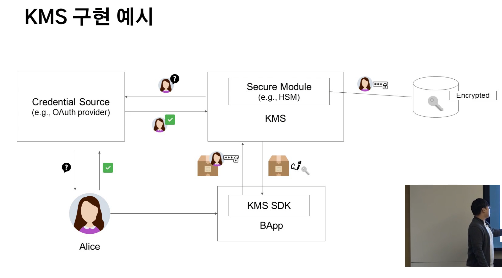

# SEC7 블록체인 사용자 경험

---

# CH1 블록체인 UX의 문제

- 블록체인의 문제
  - 성능
    - 한 블록이 처리할 수 있는 트랜잭션의 개수의 제한
    - 주기적은 블록 합의로 인해 발생하는 지연
  - 비용
    - 합의에 참여하기 위해 필요한 비용
    - 블록을 유지하기 위해 필요한 비용
  - 불편함
    - 사용자가 가스비를 내야하는 불편함
    - 사용자가 직접 키를 관리해야하는 불편함
- Klaytn의 해결법
  - 성능
    - 4000TPS
    - 1초 블록생성 주기
  - 비용
    - 대기업 참여지만 블록체인의 룰을 따라감
    - KAS(WIP): 블록체인의 최근의 정보를 줌
  - 불편함
    - 가스비 대납 기능 구현
    - 키 관리 체계 구현

---

# CH2 가스비 개선

- 가스비
  - TX를 처리하는데 필요한 자원을 비용으로 전환한 것이 가스(gas)
    - 플랫폼 사용료
    - EVM 명령어마다 정해진 가스량이 존재
    - Sender는 (Tx의 처리를 위해 필요한 가스의 총량) x (Gas Price)만큼의 KLAY를 제공
  - 복잡한 연산을 수행할 수록 높은 가스비가 소모
    - Klaytn의 Gas Price는 25 ston/gas (0.000000025 KLAY)로 고정
    - KLAY 전송에 필요한 가스비는 0.000525 KLAY(21,000 gas)
    - Count 컨트랙트를 배포하는데 약 183,000 gas가 필요
- 문제점
  - 사용자가 트랙잰션 가스비 비용을 붎필요한 비용이라 생각
  - 사용하는 코인/토큰이 KLAY가 아닐 경우 붎필요한 비용이라 생각
- 문제점 해결
  - 대납의 필요성
    - **트랜잭션을 보내는 사람(Sender)**과 **가스비를 부담하는 사람(Payer)**를 구분
    - sender는 일반 유저, payer는 운영사라고 정의
    - payer는 sender가 서비스를 seamless하게 사용.
    - sender의 서비스 사용이 payer의 매출 확대로 이어지도록
  - Klaytn Fee Delegation
    - 대납 트랜잭션은 **두개의 서명**을 가집
    - 트랜잭션은 Sender가 생성하고 서명한 뒤 Payer에게 전달 = Sign1
    - Payer는 Sender가 전달한 트랜잭션에 추가정보를 기입하고 서명 = Sign2
    - 각각의 서명이 sender 주소와 payer 주소에 부합할 경우 트랜잭션이 옳다라고 정의
    - 가스비는 Payer의 밸런스에서 차감(nonce 변경 없음)

    ```java
    // Sender-side
    const { rawTransaction: senderRawTransaction } = await caver.klay.accounts.signTransaction({
        type: 'FEE_DELEGATED_VALUE_TRANSFER',
        from: sender.address,
        to: '0x34ca11930cd5e0971d8bb9860d9b977d3bb9187b',
        gas: '3000000',
        value: 1,
        }, sender.privateKey);
    // Payer-side
    const { rawTransaction: finalTx } = await caver.klay.accounts.signTransaction({
        senderRawTransaction: senderRawTransaction,
        feePayer: payer.address
    }, payer.privateKey);
    ```

    - 대납의 장점
      - UX 향상
      - 불필요한 토큰 거래 최소화
      - 사용자층 확대
      - 트랜잭션 규모 확대
    - 단점
      - 플랫폼 성능 저하(여러 서명 검증)
      - 서비스 개발 복잡도 증가
      - 서비스 관리비용 증가(TOSS 기준 일 264 USD)

---

# CH3 키 관리 개선

- 키관리의 어려움
  - 잃어버리면 복구 불가능
  - 분실 해킹의 위험
  - 낮은 가독성 + 외우기 힘든 문자조합
- Key Management System (KMS)
  - 키만 다른사람에게 위임
  - 키를 클라우드 서비스가 관리하는 아이디어
    - KMS는 키를 안전한 곳에 보관. 사용자는 KMS에 트랜잭션을 전송하여 서명을 요청
    - 사용자 인증이 성공할 경우 KMS는 사용자에게 **서명된 트랜잭션**을 전달
    - 키는 2중으로 암호화되어 보관
    - 복호화된 키는 KMS도 열람할 수 없는 장치를 구현
    - 
- KMS 장점
  - UX 향상
  - 키 분실, 해킹 위험 최소화
  - 사용자 인증을 통해 KYC 수행
  - Seamless한 One Key <-> Multi bapp 실행
- 단점
  - 키 관리 주체가 중앙화(SPoF)
  - 키 관리 비용 발생(하드웨어, 운영인력 등)
  - 키 분실 또는 훼손 시 책임 발생
