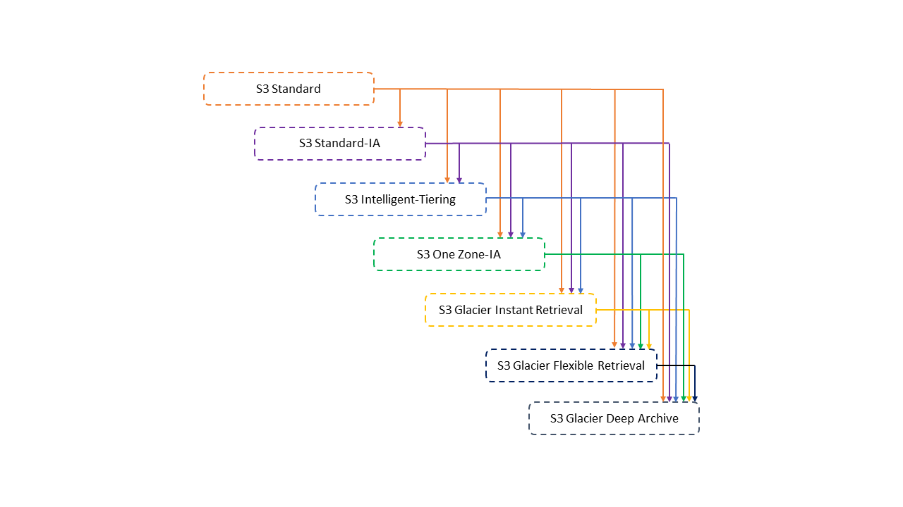

## AWS Glue
AWS Glue 콘솔의 작업 실행 모니터링 섹션을 검사한다. 이전 작업 실행 결과를 검토한다. 적절한 DPU 수를 결정하도록 프로파일링된 지표를 시각화한다.

정답입니다. AWS Glue 콘솔의 작업 실행 모니터링 섹션을 사용하여 이 시나리오에 적합한 DPU 용량을 결정할 수 있습니다. AWS Glue 콘솔의 작업 모니터링 섹션에서는 이전 작업 실행 결과를 사용하여 적절한 DPU 용량을 결정합니다.

DPU 용량을 결정하는 방법에 대해 자세히 알아보십시오.

https://docs.aws.amazon.com/glue/latest/dg/monitor-debug-capacity.html

## S3 LifeCycle

- S3 Intelligent-Tiering은 액세스 패턴이 변화하거나 알 수 없는 경우에 유용
- 자주 엑세스 하지 않는 경우는 Standard-IA
- 실시간 엑세스가 필요하지 않은 경우는 Glacier Flexible Retrieval
- s3에 30일동안 저장되야 ia, one-zone ia로 변경 가능 glacier는 90일
- glacier는 복원작업을 따로 거쳐야 함
- Redshift Spectrum은 S3 Glacier Instant Retrieval 데이터에 액세스하고 쿼리할 수 있는 기능을 제공하지 않습니다.
- Amazon Redshift는 데이터를 S3 Glacier Instant Retrieval에 직접 언로드할 수 없습니다.
Redshift MV 까먹지 말 것
- 보고서의를 refresh만으로 최신화하여 보고서 성능을 개선
- Deep Archive Access 등급으로 마이그레이션된 모든 데이터를 검색하는 데 12시간 이상 걸릴

## kinesis + Lambda 처리량 늘리기
- IteratorAge가 높다는 것은 Kinesis 데이터 스트림에서 마지막으로 읽은 레코드의 수명이 늘어난다는 의미
- Kinesis Data Streams와 Lambda를 사용할 때 처리량을 늘리는 한 가지 방법은 리샤딩(샤드 개수 늘리기)으로 Lambda는 샤드에 하나의 람다 함수를 연결할 수 있습니다. 
- ParallelizationFactor를 늘려 하나의 샤드에서 여러 람다 함수를 실행
- 향상된 팬아웃 설정
  - 샤드당 초당 최대 2MB의 데이터 처리량으로 스트림에서 레코드를 수신할
  - 스트림당 최대 20명의 소비자를 등록하여 향상된 팬아웃 기능을 사용
  - Kinesis 향상된 팬아웃
    - https://docs.aws.amazon.com/streams/latest/dev/enhanced-consumers.html

## Lake Formation
- 데이터베이스, 테이블, 열, 행 및 셀 수준에서 보안을 구현

## Glue Data Brew
- 데이터를 정리하고 정규화할 수 있는 시각적 데이터 준비 도구
- 이상 필터링, 데이터 표준형식 변환, 잘못된 값 수정
  - Null 제거, 누락된 값 교체, 스키마 불일치 수정, 함수 기반 열 생성 등이 포함

## SageMaker Data Wrangler
- 데이터 가져오기, 준비, 변환, 기능화 및 분석을 위한 엔드투엔드 솔루션을 제공하는 Amazon SageMaker Studio Classic의 기능
- ML 모델 배포

## ML 계보추적
- https://docs.aws.amazon.com/sagemaker/latest/dg/lineage-tracking.html
- 워크플로 단계를 재현하고, 모델 및 데이터 세트 계보를 추적하고, 모델 거버넌스 및 감사 표준을 설정

SageMaker 특성 저장소를 사용하여 ML 모델용 기능을 생성, 저장 및 공유

SageMaker Data Wrangler를 사용하여 EDA를 실행하고 ML에서 사용할 데이터를 준비할 수 있습니다.
데이터가 정확한지 체크는 불가능

