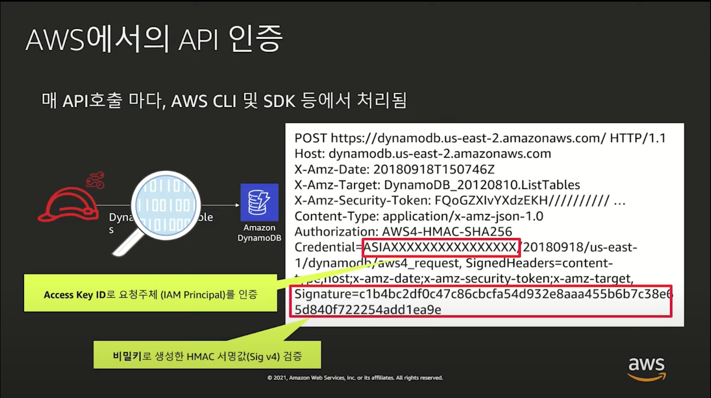
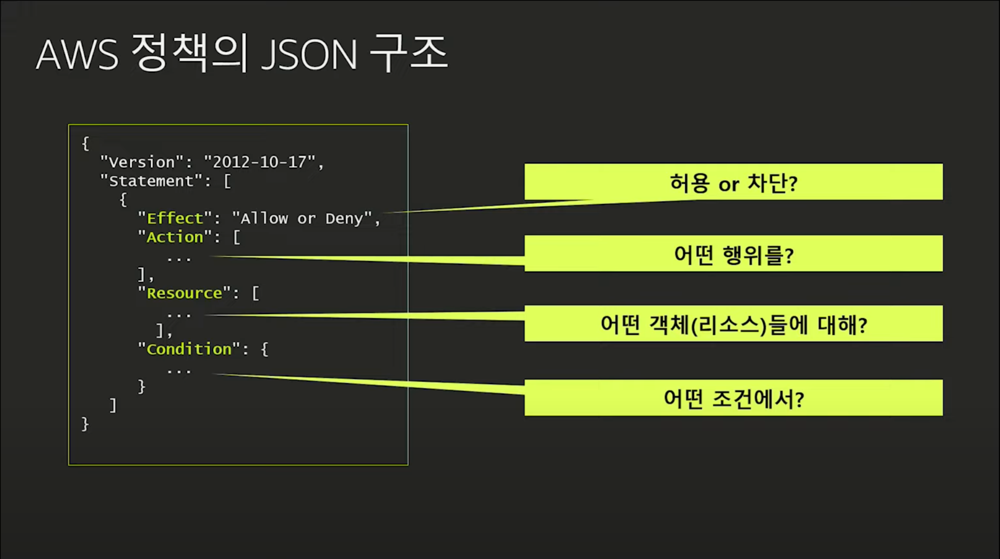
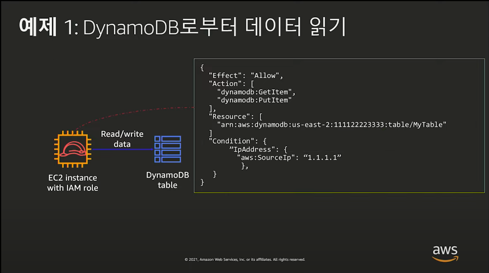
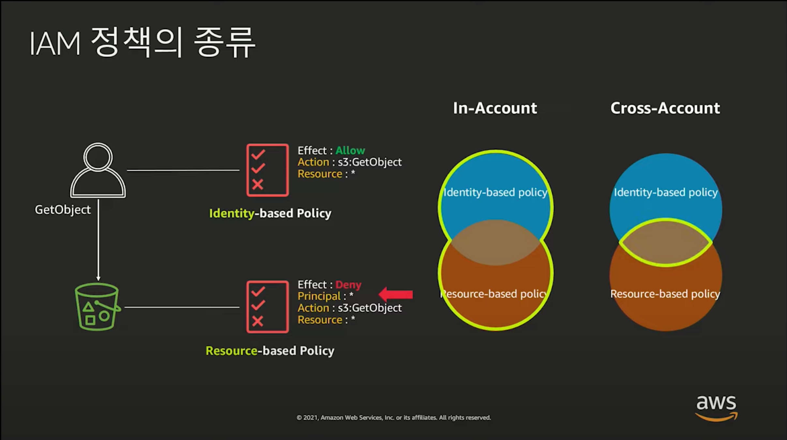
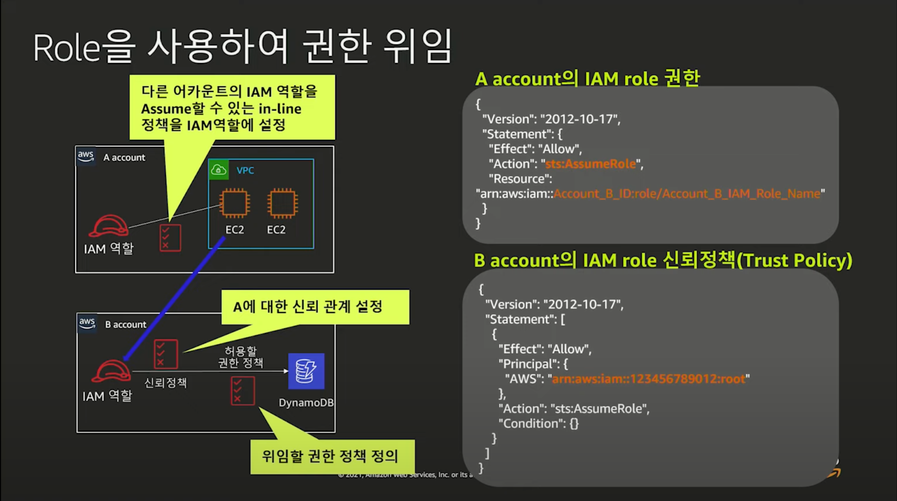

# AWS IAM과 친해지기

링크 - <https://www.youtube.com/watch?v=zIZ6_tYujts>

---

### IAM 사용법

- Console => Script 기반 => 프로비저닝 엔진(CloudFormation, Terraform 등) => CDK
- 각각의 방식은 다 다르지만 다 API로 프로젝션 된다. (= Everything API)

### API 인증

- 자격증명 = access key id, secret key
- 매 호출마다 자격증명을 인증함

---

## AWS IAM(Identity and Access Management)

: IAM은 인증과 인가로 이루어짐

### 인증

- 클라이언트가 올바른 사용자인지
- IAM User는 장기적 Credential을 사용, 노출되면 위험
- IAM Role은 임시 Credential, secret key + access key + token(임시)으로 이루어짐
- Role을 사용하는 것을 Assume한다고 함

### 인가

- 클라이언트가 허가된 작업을 요청하는지
- 접근제어 정책을 기반으로 인가
- 디폴트는 전체 Deny
- 명시적 Allow보다 명시적 Deny가 우선순위

---

## AWS 정책 구조

### 예시

- 특정 리소스: DynamoDB에 MyTable
- 특정 조건: 1.1.1.1 IP만
- 특정 액션: get과 put연산만 지원
- 허용 여부: 허용

---

## IAM 정책의 종류

여러가지 있지만, 주로 사용하는 두 가지에 대해서 설명함.

### Identity based 정책

- 접근을 하기 위한 정책

### Resource based 정책

- 접근을 받기위한 정책
- Principal이 추가적으로 들어감

- 동일계정내에서는 합집합의 형태로 조건 검사
- 다른계정끼리는 교집합의 형태로 조건 검사
- 예를 들면, Identity 측에서 Allow만 하면 동일계정은 접근 가능, 다른 계정은 접근 불가능하다.

---

## IAM 모범 사례

1. Root 사용자 액세스 키 잠금
2. 권한 있는 사용 MFA 활성화
3. 개별 IAM 사용자 만들기
4. 그룹을 사용하여 IAMM 사용자에게 권한을 할당
5. 최소 권한 부여
6. 서비스 권한 제어에 역할 사용
7. 역할을 사용하여 권한 위임
8. 자격 증명을 정기적으로 교체
9. 보안 강화를 위해 정책 조건 사용
10. AWS 계정의 활동 모니터링 및 감사
    - Access Advisor를 통해 접근여부에 따라 권한 제어
    - Credential Report를 통해 IAM 사용자 분석 가능

### Cross Account 사용

- A에서는 B에서 만든 Role을 Assume할 수 있는 정책 부여
- B에서 DynamoDB를 접근할 수 있는 IAM Role 생성
- B에서 A에서 Role을 Assume할 수 있게 허용

---

## IAM Advanced

### AWS 계정의 활동 모니터링 및 감사

- CloudTrail: API 활동기록 전부 알 수 있음.
- AWS IAM Access analyzer: 외부 인터넷과 공유되는 리소스 IAM을 판단가능
- AWS GuardDuty: 해킹시도나 보안위협 탐지
- Security Hub: AWS 환경 전반에 대한 보안정보를 통합적으로 관리하는 대시보드

### 속성기반제어

- Attribute Bases Acess Control
- 리소스의 태그를 이용해서 단일 policy로 다른 리소스에도 재사용가능하도록 접근제어 하는 방법을 의미한다.

### 클라우드 확장

- Cross Account, SSO, On promise 환경에 대해서 확장하기 간편해짐
