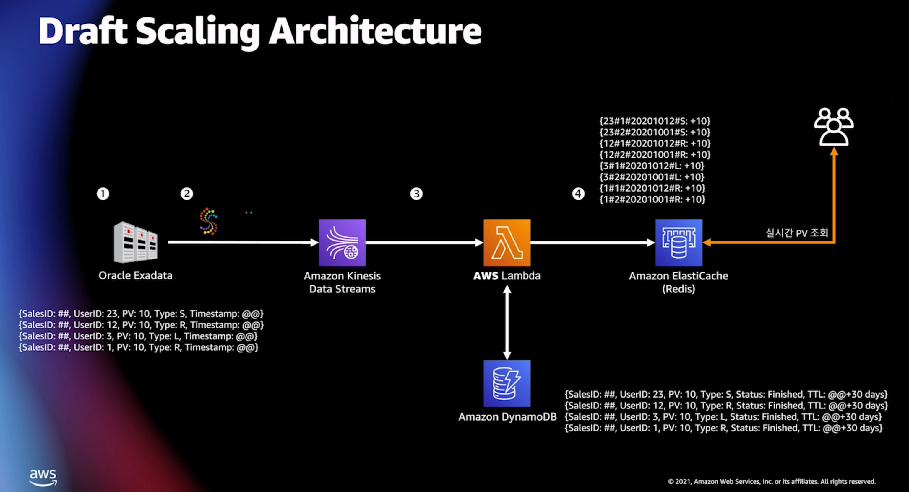
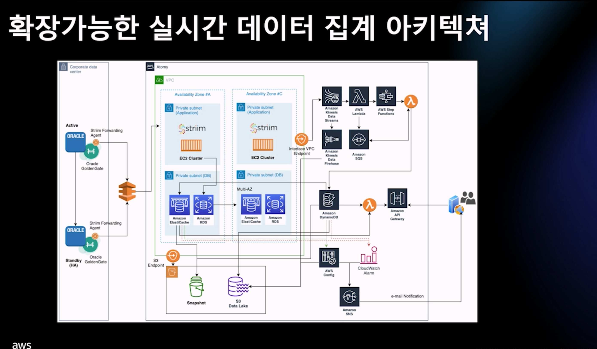

# Amazon DynamoDB 를 활용한 1억 마케터들의 실시간 판매 정산 플랫폼 구축하기

## 고객사 사례

- Atomy

  - 토종 네트워크 마케팅 기업
  - 1억명의 정산 시스템
  - 해결책
    - 데이터 베이스 리모델링
    - 리얼타임 파이프라인
    - 빠른 viable product
  - dynamodb, kinesis, lambda, stepfunction을 기반으로 만듬
  - 트리모델 구조로 점수가 반영되는데 시간이 오래걸림
    - 기존에는 connect by절로 구성되어 있음
    - path 컬럼을 통해 얻는 것 계층이 깊어질수록 효울이 안좋아짐
    - draft architecture 을 구성
      - 
    - 고려 사항
      - 마이크로 서비스
      - 데이터 모델 기준
      - 데이터 종류
      - 데이터 동기화
      - 운영관리
      - 실시간
    - 최종 아키텍처
      - 

- ## Data pipeline

- 배운거는?

exactly once 딱 한건만 저장하는 프로세스를 따로 만들었어야 했음
멱등성 보장..
이벤트키를 transaction으로 저장 - 같은 key가 있다면 transaction 실패 - key는 7일 후 삭제
