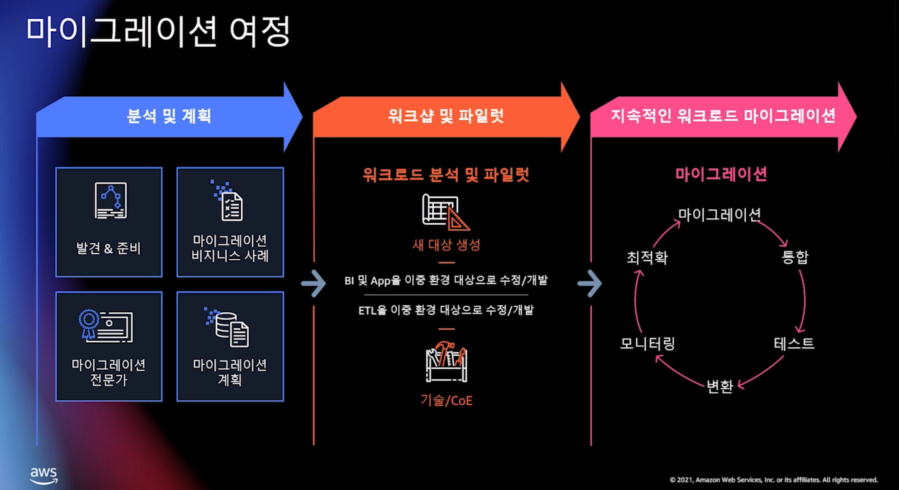
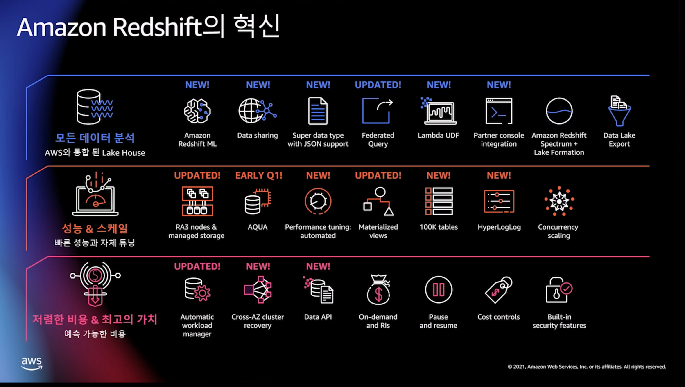

# 데이터웨어하우스 현대화

- 링크:

---

## redshift

- 선택 이유

  - 레이크 하우스 아키텍처
    - redshift spectrum
  - 모든 규모에서 빠른 성능
  - 비용 절감

- 마이그레이션 방법

  - 점진적인 워크로드 마이그레이션
  - 
  - 스키마 컨버젼 툴
  - DMS

- Redshift 기능

  - 
  - 마이그레이션할 때 유용한 기능

    - procedure를 지정하여 ETL 유효성 검사나 비즈니스 논리를 실행 가능
    - Enhanced Security Controls(CLP)
      - 컬럼 수준 접근제어 가능
    - Increases Catalog Limits
    - Enhanced Spatial Functionality
    - Time과 TimeTZ 필드

  - super 데이터 타입은 반정형 데이터를 활용 가능
  - Lambda UDF를 사용한 Tokenization 가능
  - 자동 성능 튜닝
    - 분산키와 정렬키 자동 선택
    - Vacuum delete

- DBsofia 같은경우도 Aurora로 이전이 불가능 한지?
