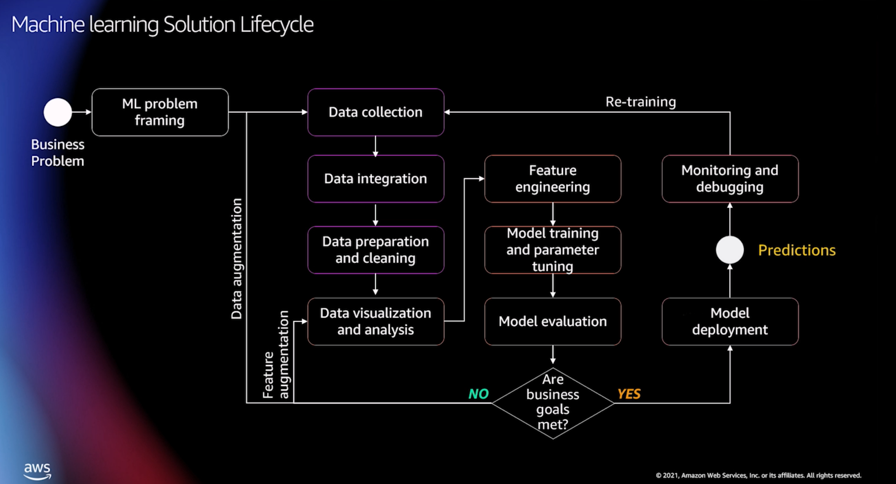

# 클라우드 기반 데이터 수집부터 ML까지

- 일반적인 머신러닝 사이클

  - 
  - 이 부분에서 managed service를 활용한다면 효율이 큼
  - 데이터 전처리
    - glue, emr, redshift, athena, sagemaker
  - 모델 훈련 및 파이프라이닝
    - sagemaker를 활용해 전반적으로 커버
  - 배포 디버깅
    - sagemkaer

- 머신러닝을 위한 데이터 처리
  - 데이터 준비
    - Databrew
      - s3, redshift, rds, glue등에서 파일 업로드 가능
      - EDA를 자동으로 해줌
      - 새컬렁 생성 및 컬럼별 분석 가능
      - 레시피라는 변경과정을 담아 재사용 가능
      - 다른 데이터와의 조인 가능
      - outlier 삭제
    - sagemaker datawrangler
      - 데이터의 imbalance 검출
      - 데이터 누락값 처리
      - 각 과정을 기록하고 notebook으로 export 가능
      - databrew보단 머신러닝 모델 전처리에 최적화 되어 있음
