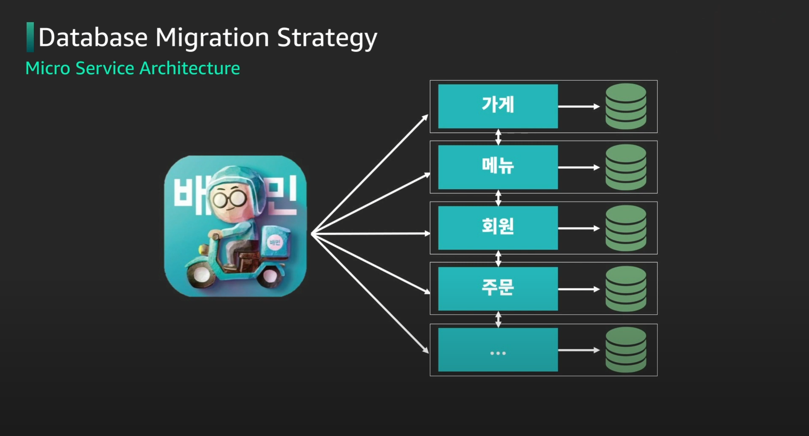

# 변화와 혁신을 위한 클라우드 마이그레이션

링크 - https://www.youtube.com/watch?v=iFktTPfD0dg&list=PLORxAVAC5fUUsx6EeahxsZYYbuSxe6IFr&index=5

Migrationg
- 단순 비용 절감이 아닌 직원 업무 생산성, 운영탄력성, 비즈니스 민첩성 을 늘리는 **비지니스 가치 관점**으로 봐야함
- Migration Accelaration Program을 통한 체계화된 마이그레이션을 진행함
- TSO Logic을 통한 IDC 환경의 비용 파악하여 클라우드와 비교

---

## 네오위즈 AWS 마이그레이션

### 도입배경
- 2010년 당시 데이터 센터의 노후화로 인한 장애
- 새 Data center vs 클라우드 마이그레이션의 기로
- business / people / cost 세가지 관점
    - 구축 속도와 자동화를 통한 안정성
    - 직원들에게 기술 trend에 대한 자부심이 생김
    - 유연한 비용 관리, 매몰 비용 없음

=> 급변하는 비지니스 니즈에 대응, 엔지니어로서 자부심, 비용 효율적인 IT 구축을 위해 2020 도입 결정

### 검토 과정
- 장/단점 분석
- TCO 분석(IDC vs AWS)
- 기술직군 설문조사: 흥미

### 준비 과정
- 파트너사 선정: 상생, 보안체계, 서포트
- 협력 범위 정하기

### 모토
- 마이그레이션은 빠르게 테스트하고 빠르게 바꾸자.

### 마이그레이션 과정
- 대상 선정 -> 인프라 구축/개발 -> Open 준비(시나리오) -> 서비스 전환 -> 회고 -> 최적화

### 어려움
- Resource: 기존 리소스들과의 충돌
- Capability: 멤버들의 AWS 친숙함 부족
- Incident: 장애
- Exhausted: 지침

### 변화
- 개발 생산성
- 운영 탁월성
- 비즈니스 민첩성
- 서비스 안정성

---

## 우아한형제들 Database Cloud Migration

### 도입 배경
- MAU(Monthly Active User)
- 마켓시장의 규모 증가
- 모놀리틱 데이터 베이스
    - 부분적인 이슈가 전체 장애로 확산
    - 트래픽에 따른 Scale 정책 적용 불가
    - 신규 서비스 및 기능 추가시 속도 저하

### 클라우드 마이그레이션 실패 경험
- 기존 클라우드 스펙으로 커버 불가능
- HA 구성과 복잡함

=> MSA 구조로 변경

### MSA 구조로 Migration

- 과정
    - 마이크로 서비스 단위 정의 (회원, 주문)
    - 핵심 데이터 리스팅
    - 마이크로 서비스 단위 마이그레이션
    - 레거시 코드 빛 가비지 데이터 정리 후 백업
- 무중단 마이그레이션
    - 특정 시점 데이터 마이그레이션
    - 데이터 동시 적재하며 데이터 검증
    - Target DB로 커넥션 변경
    - SourceDB 커넥션 제거

### 변화
- 서비스마다의 최적화된 아키텍처
- 신규서비스 론칭 단축
- 장애 확산 방지
- 퍼포먼스 향상
- 손쉬운 모니터링 환경

---

