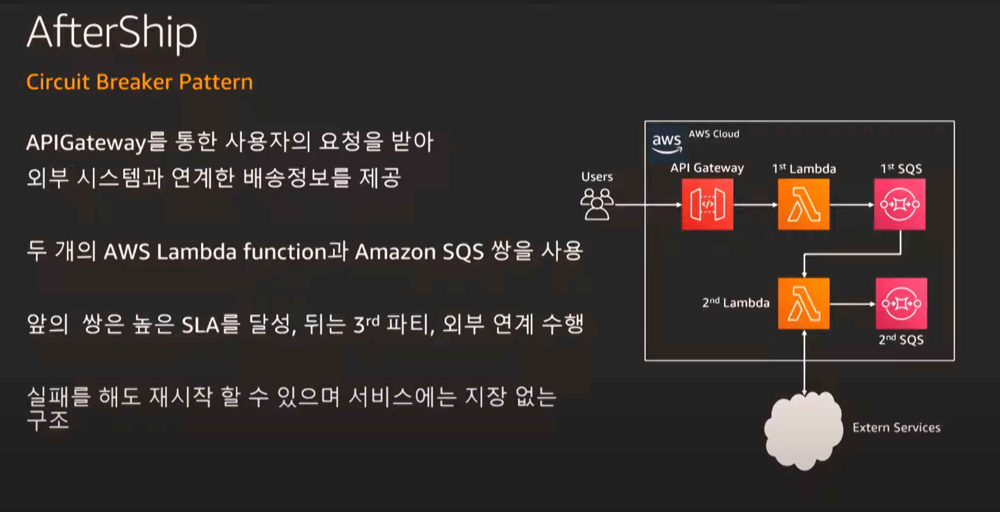
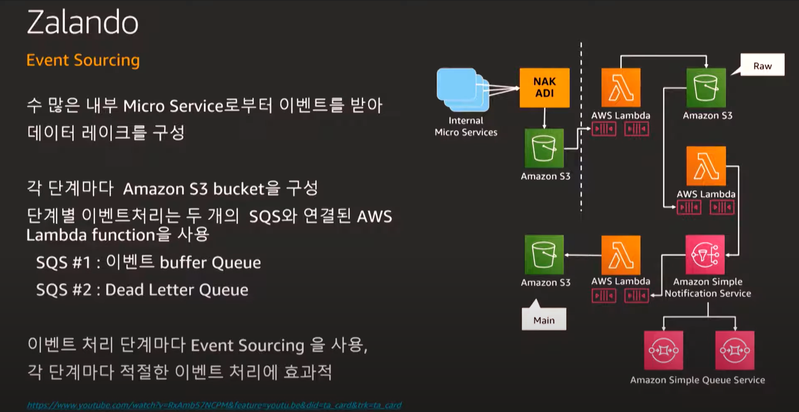
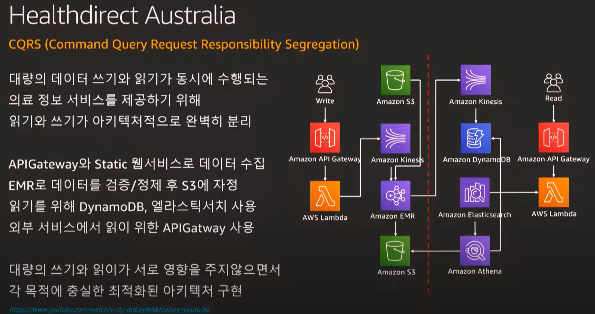
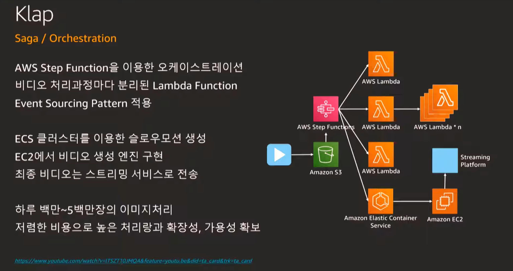
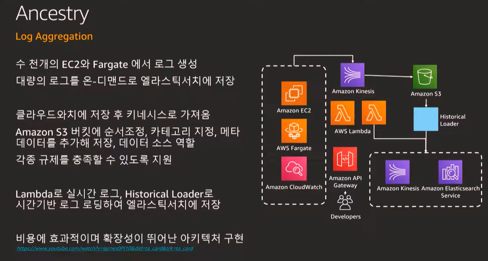

# 디자인 패턴과 고객 사례로 살펴보는 현대적 어플리케이션 개발 
- https://www.youtube.com/watch?v=uC1Eb20ZjGs&list=PLORxAVAC5fUWAd4oEEXU-PSb4LELpPA82&index=19
- 고객 사례 부분만 시청

# 고객 사례
- aftership
    - 
- Zalando
    - 
- Healthdirect Australia
    - 
    - 쓰기와 읽기의 분리
    - 정형은 dynamodb 비정형은 s3에서 읽어들임
- Klap
    - 
    - 영상처리를 lambda를 다중실행
- Ancestry
    - 
    - 

