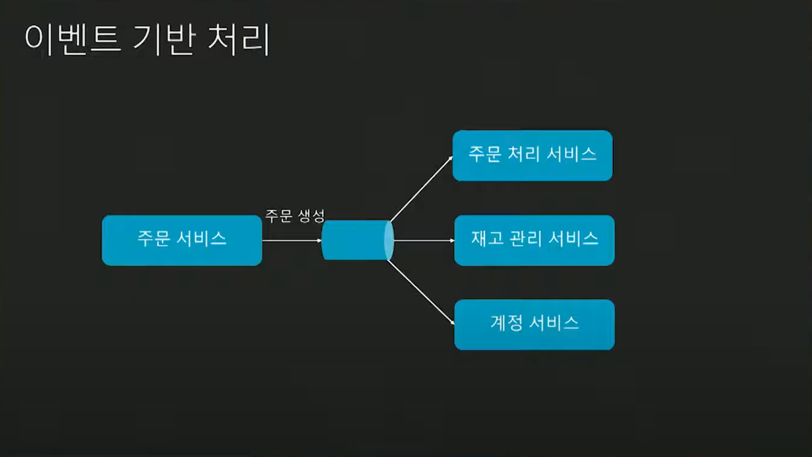
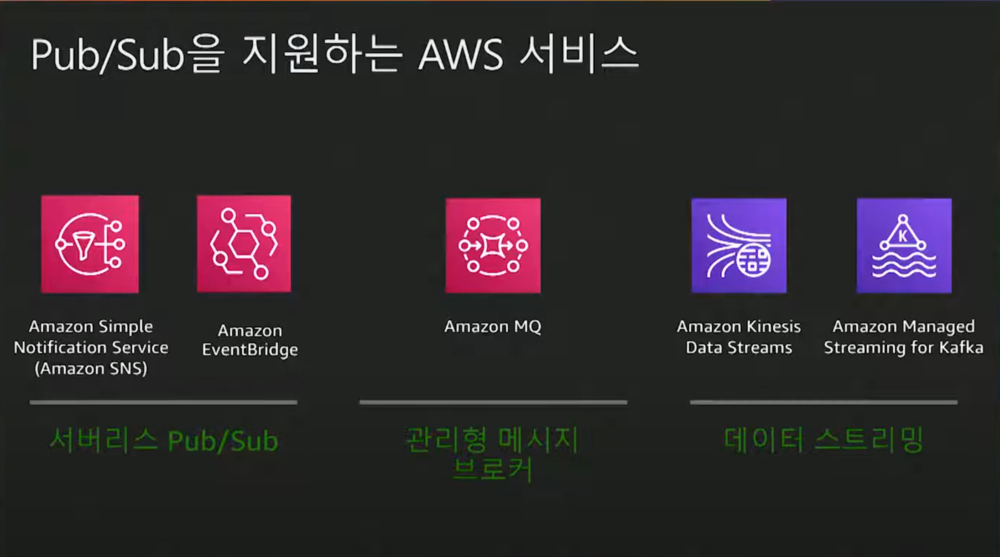
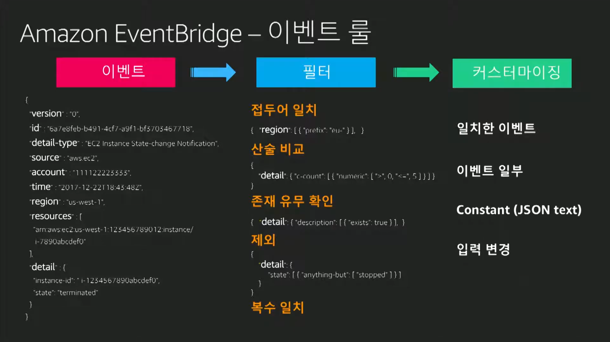
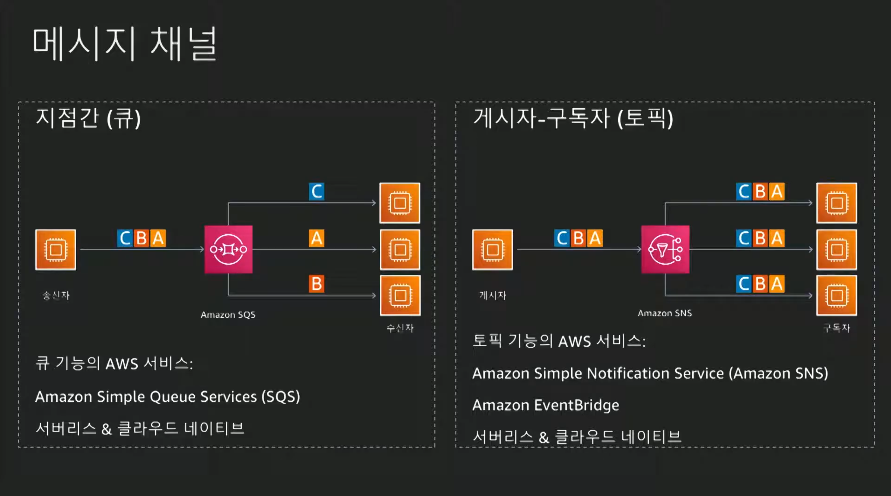

# 이벤트 드리븐 아키텍처 구축을 위한 적절한 어플리케이션 통합 서비스 선택 및 사용 방법
- https://www.youtube.com/watch?v=BIm8E6XnXmQ&list=PLORxAVAC5fUWAd4oEEXU-PSb4LELpPA82&index=28

## 이벤트 드리븐 아키텍처
- 이커머스내 예시
    - 
- 이벤트는 '관찰'이다.
    - request/response가 아님
    - 발생한 사건을 표현
    - 중요한 정보
    - 이벤트는 변경할 수 없음
    - 이벤트 처리 부분에는 관여하지 않음
    - ex) 새로운 주문이 생성되었음.
- 메시지 형식은 json이 좋좋
- 장단점
    - 메시지 자체만으로 메시지를 파악할 수 있어야 함.
    - 추가 비용 없이 적용 가능한 유용한 정보?
    - 마이크로 서비스 구조
    - pub/sub 구조

---

## 어플리케이션 통합 서비스
- 
- eventbridge
    - 완전 관리형
    - rule로 이벤트를 걸러낼 수 있음.
        - 

## 어플리케이션 통합 방법
- 
- 지점간 연결 = 큐
- 게시자 - 구독자 = 토픽
- 토픽과 큐를 연결하여 사용할 수 있음
- 예시
    