# AWS 2019 서울 서밋 IAM영상 리뷰
링크 - https://www.youtube.com/watch?v=iPKaylieTV8&t=1s

---

# IAM 종류
- RootAccount
    - 초기에 생성, 사용하지 않는 걸 추천
- IAM 사용자, 역할 Federated 사용자
- 임시 보안 자격 증명

---

# AWS 서비스 사용 방법
- console 기반
- script 기반
- **프로비저닝 엔진**
    - terraform
    - cloud formation
- DOM 모델
- CDK(Cloud Development kit) 개발중

=> 결국 중요한건 API 
- 자동으로 시그니처(시간, 리전 등)를 추가하여 보냄

---

# IAM Policy
- AWS 서비스와 리소스에 대한 인가 기능을 제공
- Policy 정의
    - 어떤 IAM Pricnipal이 어떤 Condition에서

- Policy 종류
    - Organization - Service Control Policies - 어카운트 Principal 제어
    - **IAM(Identiry and Access Management)** - Permission Policeies, Permission Boundaries
    - Security Token Service - Session Policies
    - Specific AWS services - Resource based Policies
    - VPC Endpoints - Encpoints Policies

=> 모든 Policy는 동일한 json 문법 사용 (ACL은 xml) 
=> Identity기반 정책과 Resource 기반 정책으로 나뉨

---

## Policy 구조
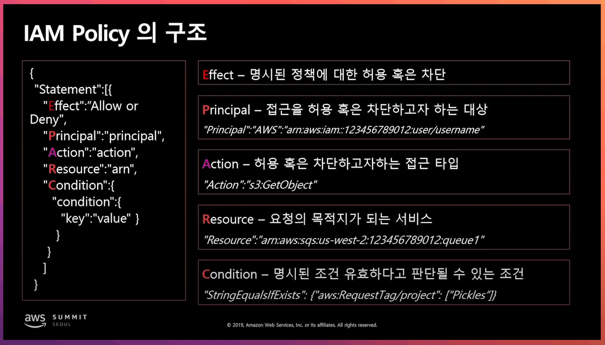

---

### 권한 할당 원칙 1 - 명시적 Deny, 묵시적 Deny
- 일단은 명시적 deny를 먼저 살펴보고 나머지는 암묵적으로 deny 된다

### 권한 할당 원칙 2 - 명시적 허용
1. 명시적 deny가 없어야함
2. permission boundary에서 허용
    - permission boundary - policy를 제한하는 기능
    - permission policy와 boundary는 묵시적 deny에 해당됨
3. permission policy에서 허용
    - permission policy - 사용자나 role에 할당

---

# 1번 예제
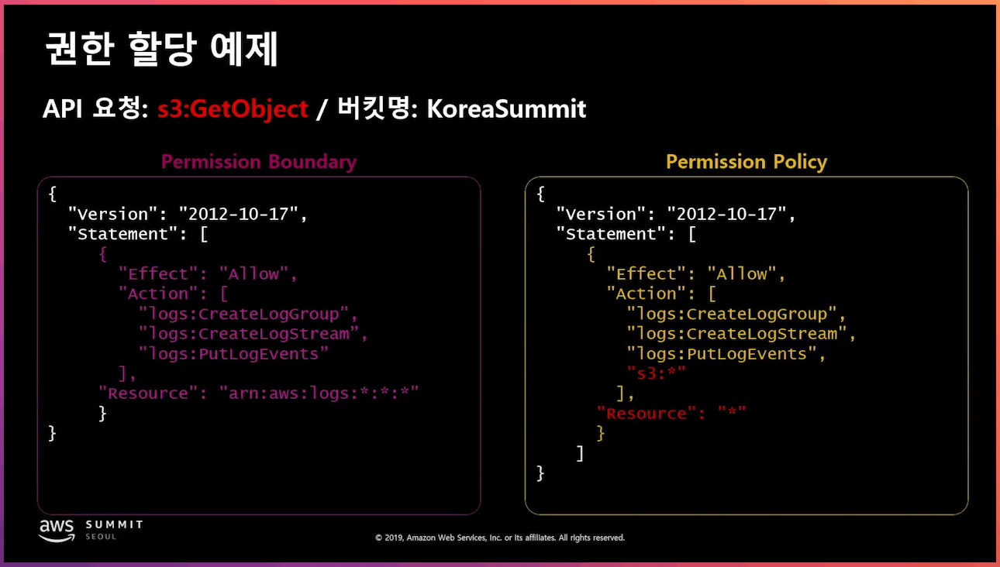
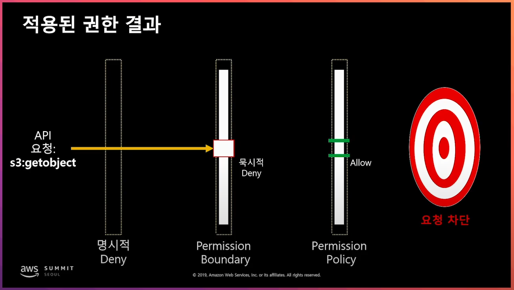
=> s3에 대한 policy는 잘 포함되어 있으나 permission boundary에서 deny가 된다.

# 2번 예제
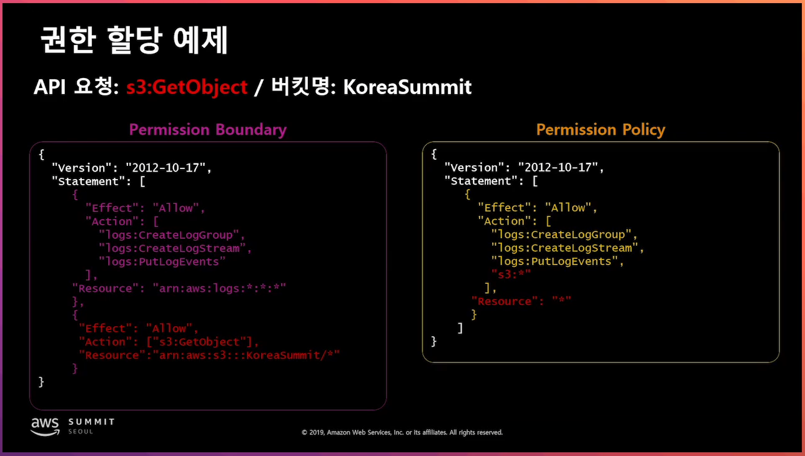
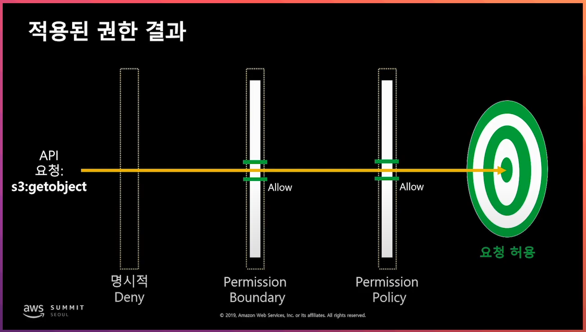
=> 정상적으로 접근 된다.

# 3번 예제

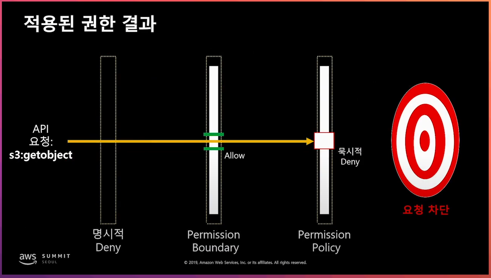
=> permission policy에서 deny된다.

# 허용 권한 획득 조건(동일 계정)
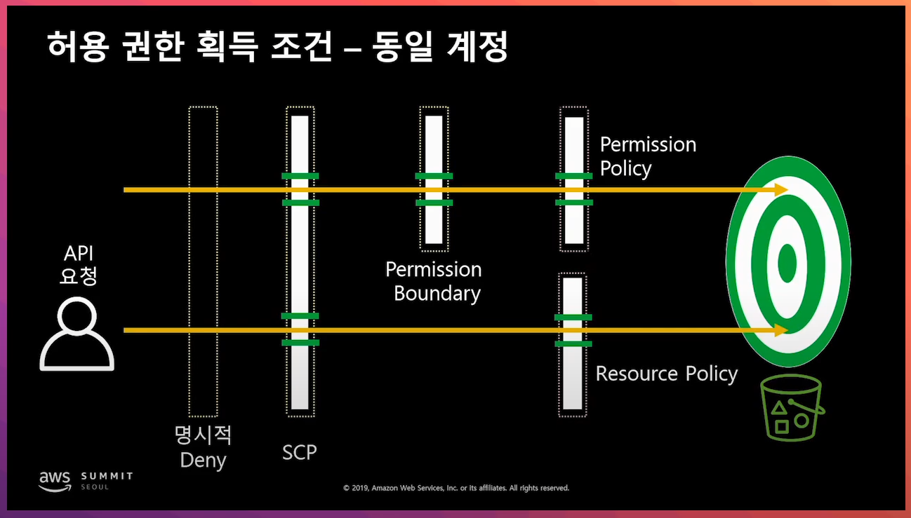
- 보내는측에서는 permission policy 받는 측에서는 resource policy 설정이 가능하다.
- OR조건이다. 둘중에 하나만 해주면 가능하다

# 허용 권한 획득 조건(다른 계정)
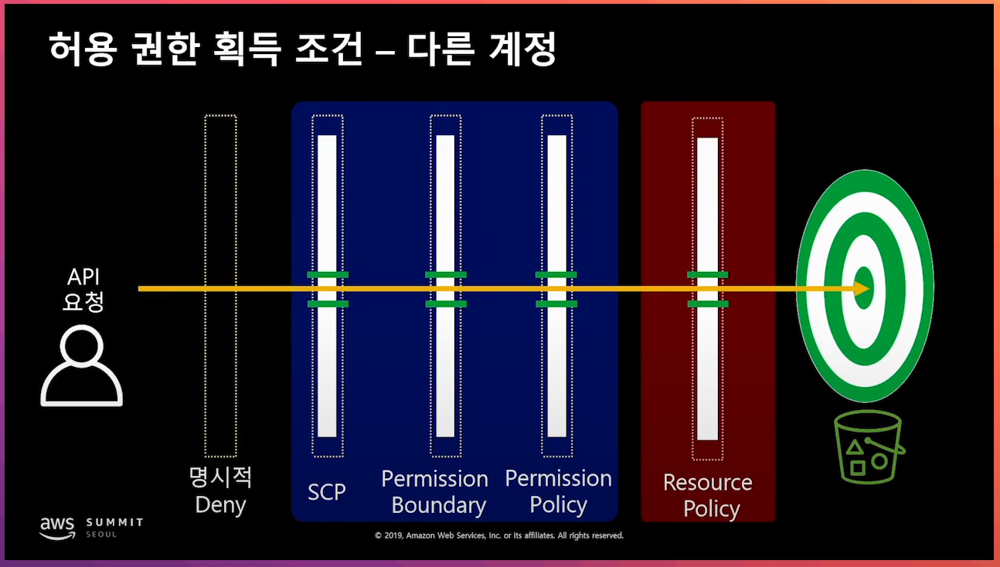
=> 송수신 둘다 policy가 갖춰져야 한다.

---

# IAM Role 활용

## IAM Role의 활용 이유
1. 보안성
2. 편리성
3. 무료

## IAM Role의 활용 - IAM 사용자 권한 최소화

- asuume role은 사용자를 role로 변경하는 것입니다.
- 개별 사용자에게 할당되는 권한을 최소화.

## IAM ROle - EC2 상의 어플리케이션
- EC2 에서 s3 bucket 접근
- 방법: 메타데이터에서 자격증명 정보 확인(임시 보안 자격 증명)
- Role을 절대 코드에 permanent하게 포함하지 않는다.

## 멀티 계정환경에서 자원공유
- role을 만들 때 principal에 특정 계정을 명시한다.
- aws 리소스 권한을 명시한다.
- 접근하는 계정에서도 assume role을 허용한다.

## TAG를 활용한 접근 권한 제어
- 특정 EC2 그룹을 특정 사용자 그룹에게 할당할 때 사용
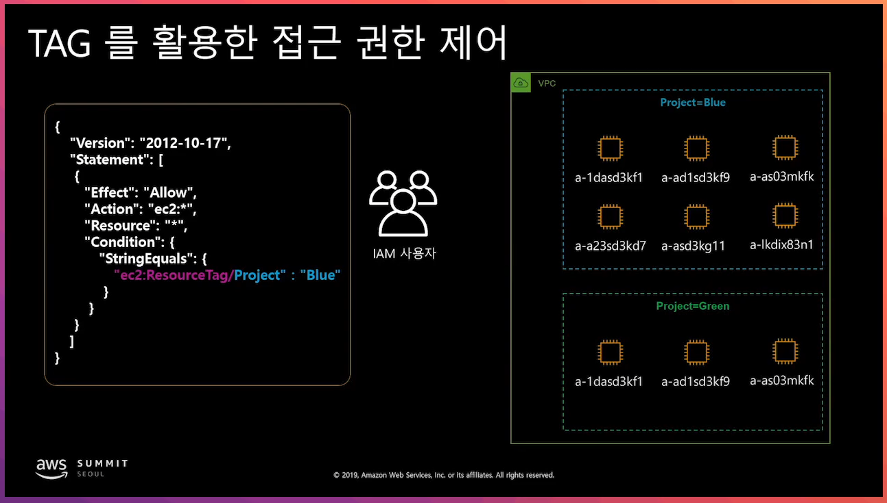

---

## IAM 정책 생성 자동화
- 사용자가 직접 policy를 생성하도록 한다.
- 하나의 보안 프레임워크 안에서 해당 policy에 대한 검증을 한다.
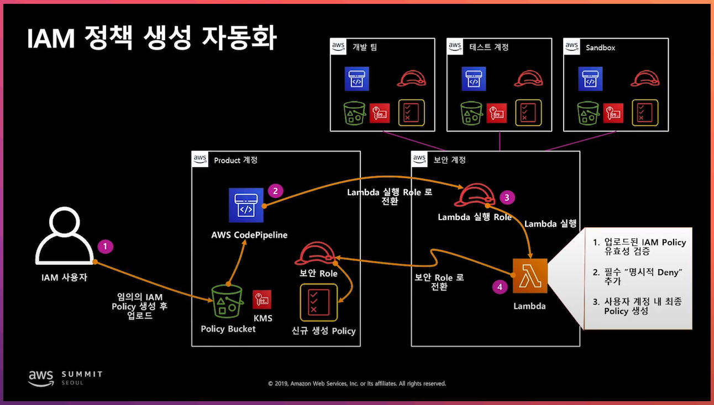

## Access Advisor를 활용한 미사용 권한 탐지
- 최대 1년간의 데이터로 마지막 접속 서비스에 대한 정보를 제공
- API를 통하여 조회 가능

## 오픈 소스를 활용한 IAM 권한 관리
- Aardvark(조회) / Repokid(삭제)
- 넷플릭스에서 개발한 오픈소스
- 특정 조건에 대한 체크
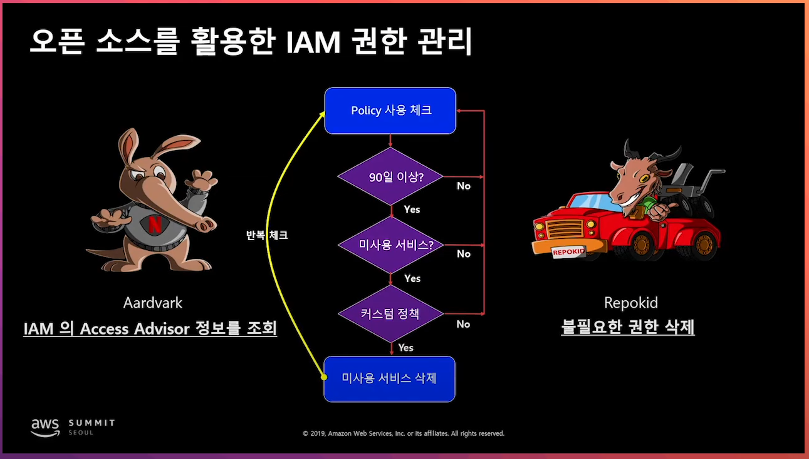

