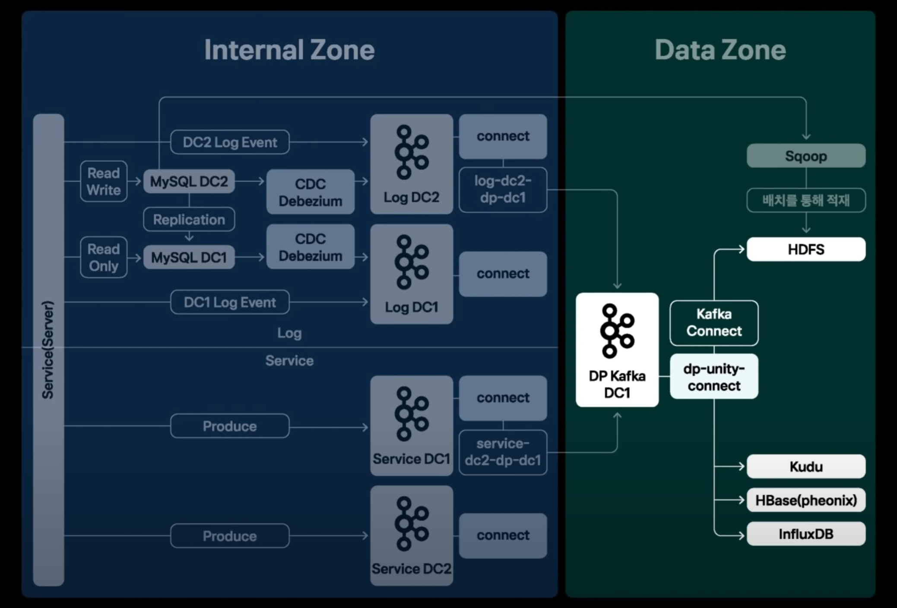
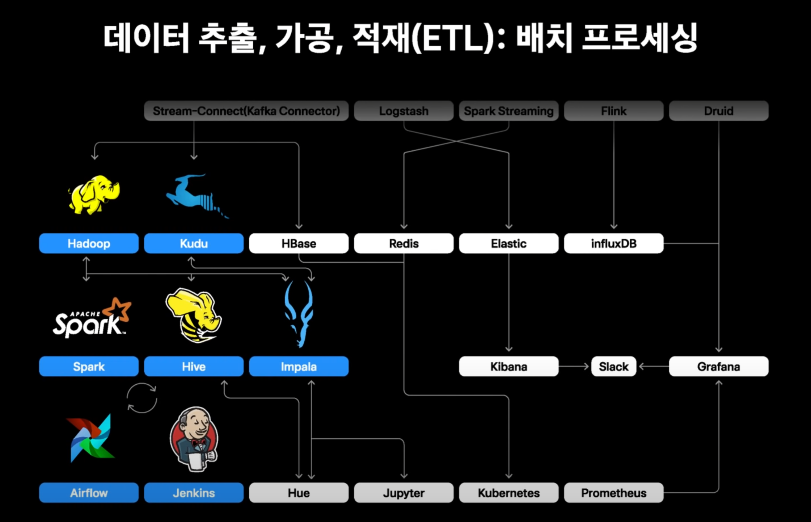
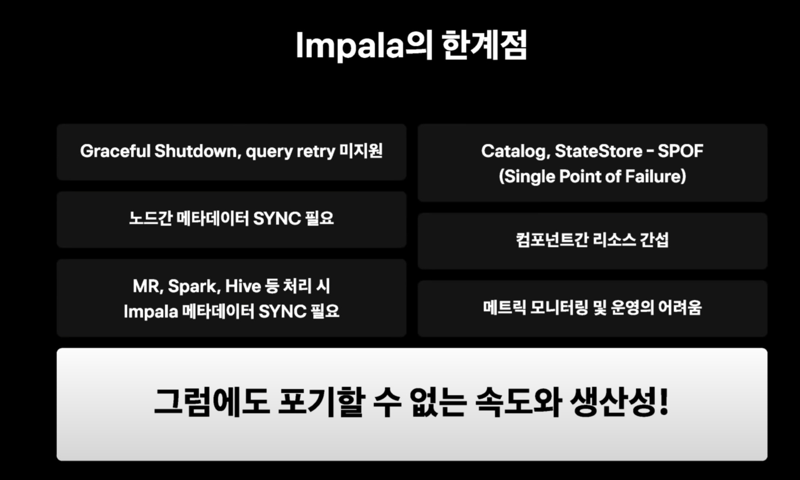
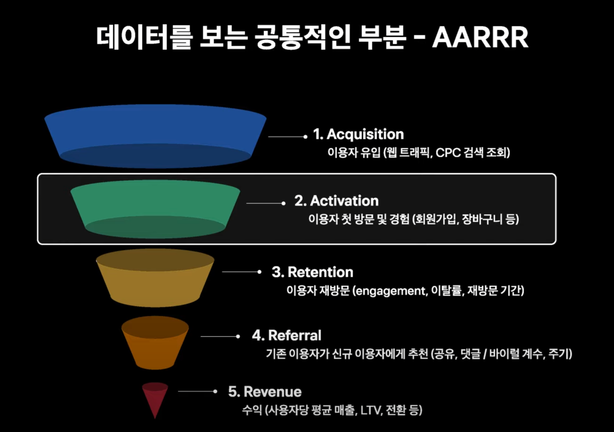
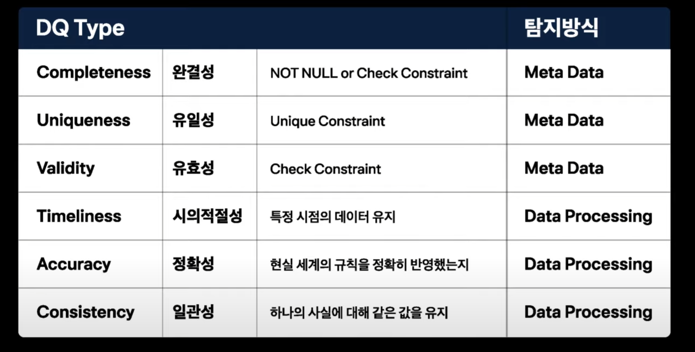
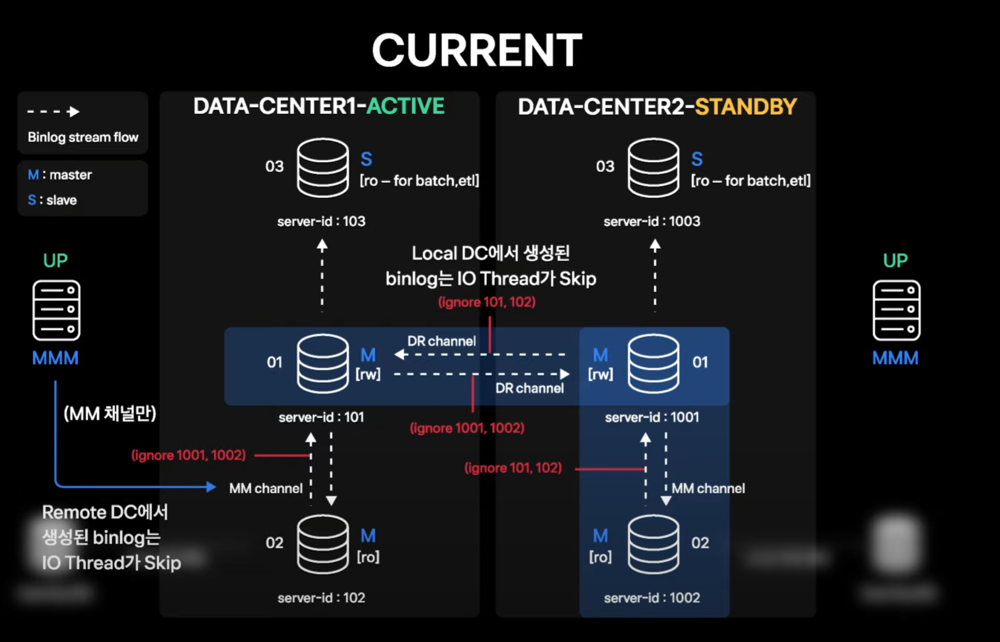
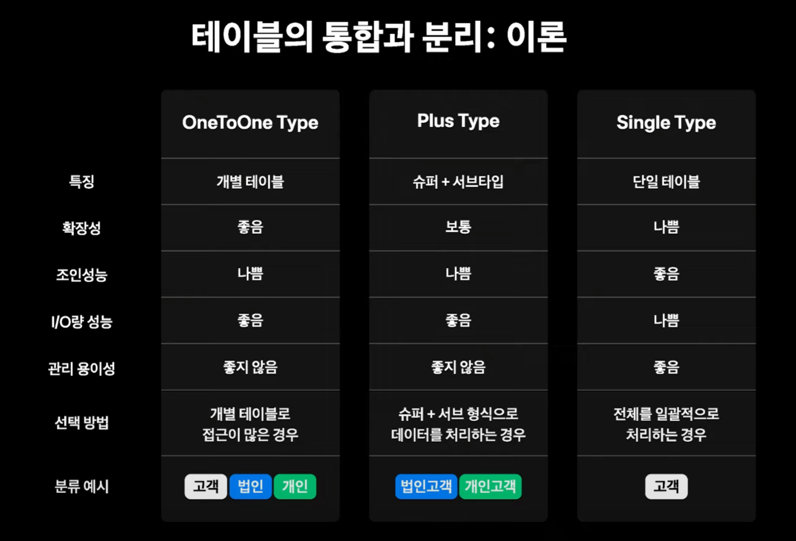

API 

accepit-Language에 따라 다양한 언어 제공

response template 만들기

SDK 사용자 관점에서 파라미터로 결제 파라미터 자체에 결제 방법이 들어가기
ㅋ

----

# 데이터의 흐름과 활용

## 데이터 정의

로그 센터라는 로그 정의 시스템
각 서비스별 로그 정의 관리

log client api - kafka - streaming - kafka - hdfs
mysql은 sqoop으로 hdfs
mongodb는 hive mongo storage handler 사용

batch centre 라는 걸 따로 만들어서 스케줄링 등록 가능

kafka는 어렵게.. 
producer는 active active
consumer는 active standby

toss datahub 사용

hdfs heterogeneous storge로 lifecycle 관리

---

## ETL

impala는 멀티 user기능과 성능으로 주로 쓰임.

한계점

간단한건 jenkins
복잡한건 airflow

---

리얼타임 프로세스는

impala로 실시간 분석은 힘듬. 당일 데이터는 kudu 사용

세그먼트별 데이터를 볼 수 있음.
이러한 웹사이트 있으면 진자 좋을듯..

---

# 빠르게 성정하는 스타트업의 DW

빠른 실험과 저렴한 실패로 인한 성장

## DB Review

dba가 리뷰 거침 - 중요

## 디멘젼 테이블 관리

- google spreadsheet로 관리하다 하나의 시스템으로 옮김
-

fact는 측정값테이블
dimension는 who/where/what/why등의 배경정보값이 들어간 테이블
fact를 볼 수 있는 창이다.

## ODS 설계 

operational data store
중간가공단계의 데이터

AARRR 살펴보기

중간 집계하는 데이터 마트생성

## batch centre

간단한 batch는 등록하여 활용하더록

## 메타정보관리

table centre
메타정보 온라인 관리
테이블에 대한 사용자 질의응답 받음

## 데이터 품질

Dq centre

dq의 타입을 정의하여 개발중에 있음.

기본적으로 빠른 탐지와 대응이 중심
적절한 시점의 자동화, 체계화 진행 시기 결정.

---

# MySQL HA & DR Topology

---

# 데이터 설계 사상

## 테이블의 통합과 분리
- 테이블을 어떻게 분리할지 통합할지
- 이론

- 공통분모를 잘 파악해라

## 순한 참조의 활용